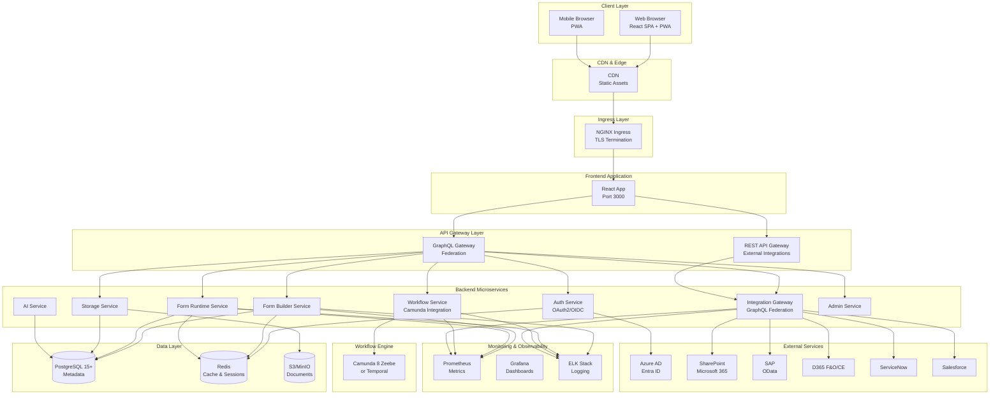
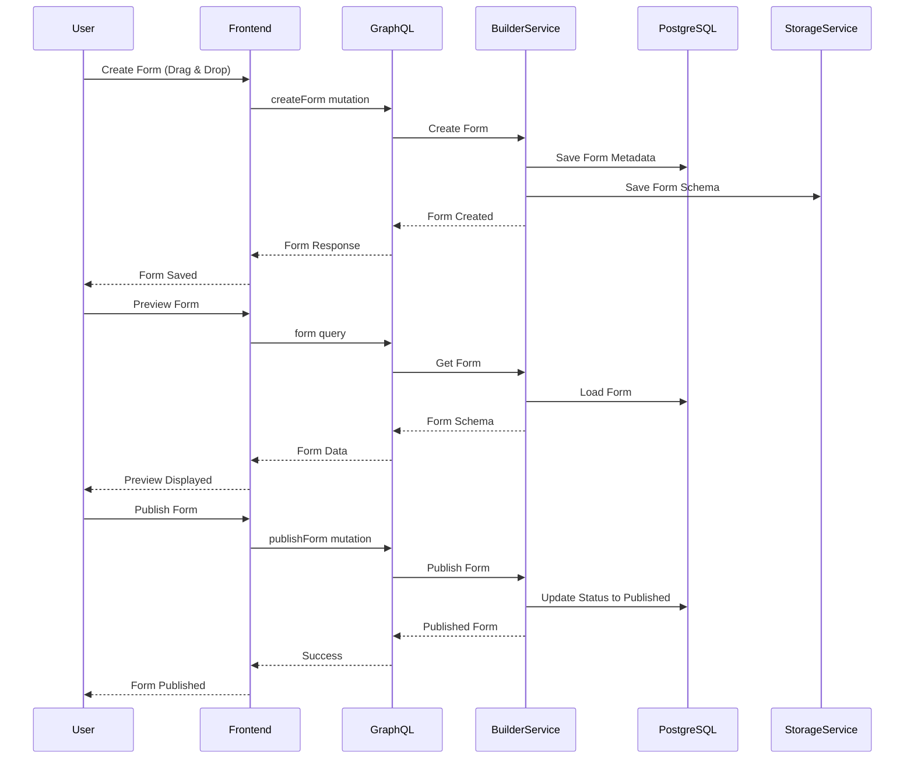
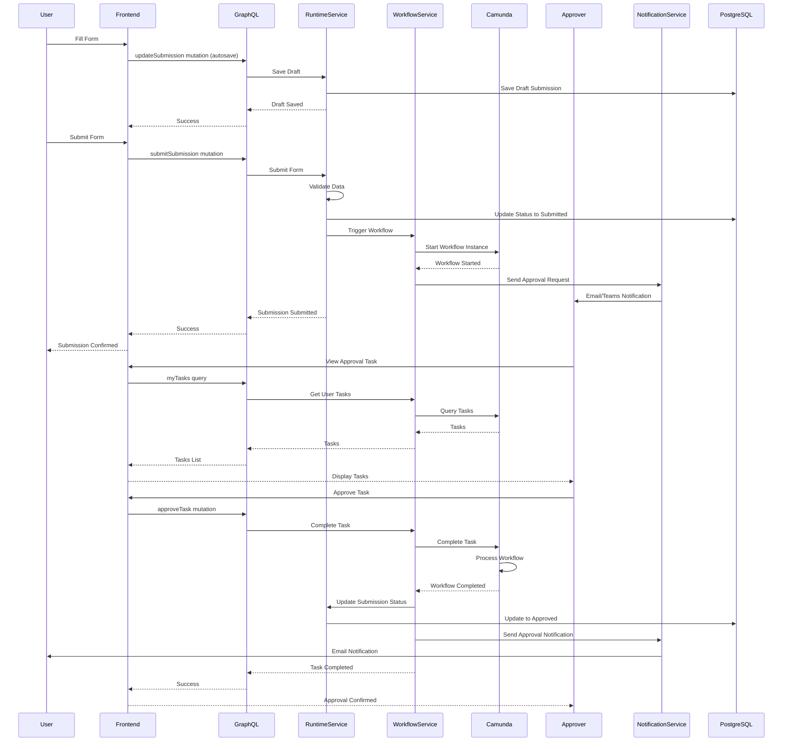
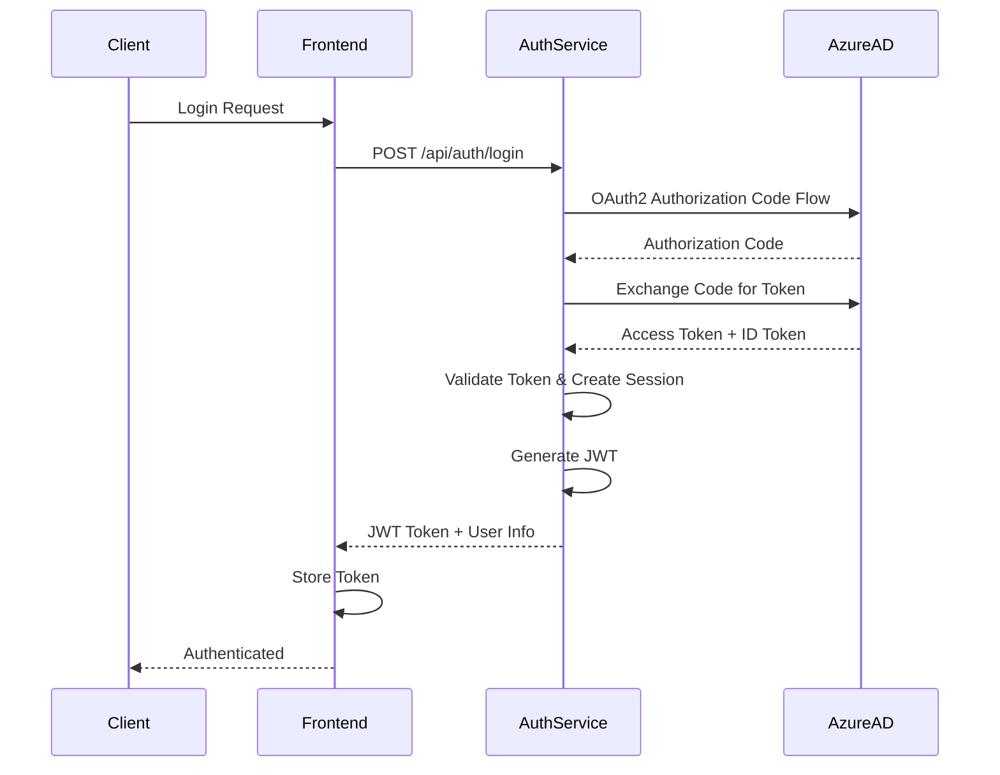
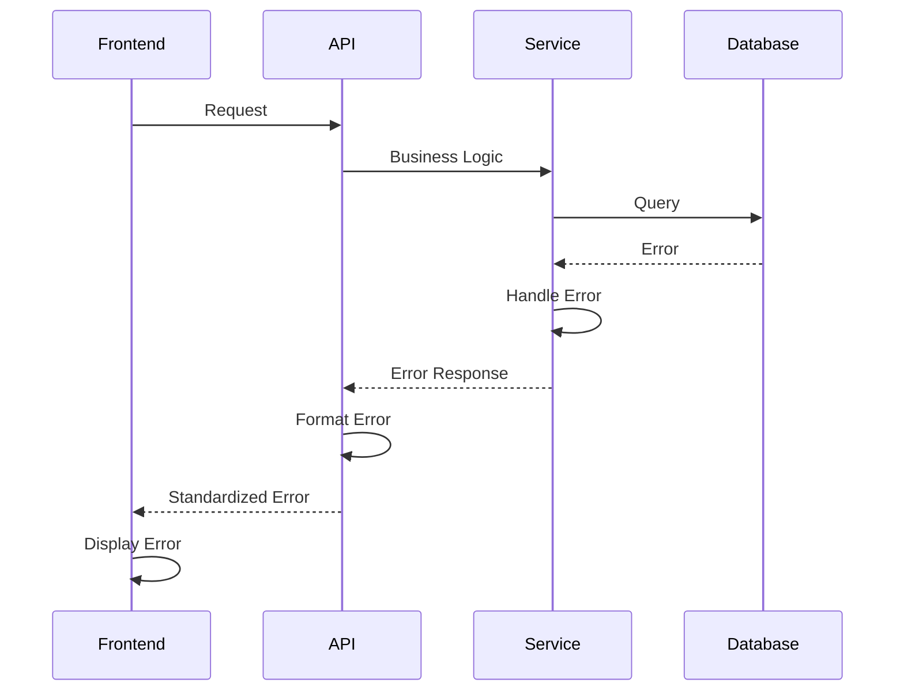

# FormXChange Suite Fullstack Architecture Document

## Introduction

This document outlines the complete fullstack architecture for FormXChange Suite, including backend systems, frontend implementation, and their integration. It serves as the single source of truth for AI-driven development, ensuring consistency across the entire technology stack.

This unified approach combines what would traditionally be separate backend and frontend architecture documents, streamlining the development process for modern fullstack applications where these concerns are increasingly intertwined.

### Starter Template or Existing Project

**N/A - Greenfield project**

This is a greenfield project starting from scratch. No existing starter templates or codebases are being used. The architecture will be designed from the ground up based on the PRD requirements.

### Change Log

| Date | Version | Description | Author |
|------|---------|-------------|--------|
| 2025-01-12 | 1.0 | Initial architecture creation | Winston (Architect) |

## High Level Architecture

### Technical Summary

FormXChange Suite follows a microservices architecture deployed on Kubernetes, supporting cloud, hybrid, and on-premises deployments. The frontend is a React 18+ TypeScript SPA with PWA capabilities, communicating with backend services through a GraphQL Federation gateway. The backend consists of 8 microservices built with .NET 8 (C#), including specialized services for form building, runtime execution, workflow automation, integrations, authentication, storage, AI capabilities, and administration. The system uses PostgreSQL 15+ for relational metadata, S3-compatible storage for documents, Redis for caching, and integrates with Camunda 8 (Zeebe) or Temporal for workflow orchestration. The architecture emphasizes scalability, security (OAuth2/OIDC with Azure AD), compliance (GDPR, audit trails), and enterprise integrations (Microsoft 365, SAP, D365, ServiceNow, Salesforce).

### Platform and Infrastructure Choice

**Platform:** Kubernetes (Cloud/Hybrid/On-Prem)

**Key Services:**
- **Container Orchestration:** Kubernetes (EKS/AKS/GKE or On-Prem)
- **Container Registry:** Docker Hub / Azure Container Registry / AWS ECR
- **Service Mesh:** Istio or Linkerd (optional, for advanced traffic management)
- **Ingress Controller:** NGINX Ingress Controller
- **Load Balancer:** Cloud provider load balancer (AWS ALB, Azure Load Balancer, GCP Load Balancer)
- **CDN:** CloudFlare / AWS CloudFront / Azure CDN (for frontend assets)
- **DNS:** Cloud provider DNS or Route53

**Deployment Host and Regions:**
- **Primary Region:** EU (for GDPR compliance)
- **Secondary Region:** US-East (for redundancy)
- **On-Prem Support:** Kubernetes cluster on customer infrastructure

**Rationale:**
- Kubernetes provides maximum flexibility for cloud, hybrid, and on-prem deployments
- Supports the microservices architecture with independent scaling
- Enables GitOps deployment with ArgoCD
- Industry-standard platform with broad support
- Supports multi-tenancy requirements

### Repository Structure

**Structure:** Monorepo

**Monorepo Tool:** Nx or Turborepo

**Package Organization:**
```
formxchange-suite/
├── apps/
│   ├── web/                    # React frontend application
│   ├── form-builder-service/   # Form Builder microservice (.NET 8)
│   ├── form-runtime-service/   # Form Runtime microservice (.NET 8)
│   ├── workflow-service/       # Workflow Engine microservice (.NET 8)
│   ├── integration-gateway/    # Integration Gateway microservice (.NET 8)
│   ├── auth-service/           # Authentication microservice (.NET 8)
│   ├── storage-service/        # Storage microservice (.NET 8)
│   ├── ai-service/             # AI microservice (.NET 8)
│   └── admin-service/          # Admin microservice (.NET 8)
├── packages/
│   ├── shared/                 # Shared TypeScript types and utilities
│   ├── ui/                     # Shared React UI components
│   └── config/                 # Shared configuration (ESLint, TypeScript, etc.)
├── infrastructure/
│   ├── kubernetes/             # K8s manifests
│   ├── helm/                   # Helm charts
│   └── terraform/              # Infrastructure as Code (optional)
└── docs/                       # Documentation
```

**Rationale:**
- Monorepo enables code sharing between frontend and backend
- Shared TypeScript types ensure type safety across stack
- Centralized CI/CD pipeline
- Easier refactoring and dependency management
- Nx/Turborepo provides build caching and task orchestration

### High Level Architecture Diagram



### Architectural Patterns

- **Microservices Architecture:** Independent services with clear boundaries - _Rationale:_ Scalability, independent deployment, technology flexibility, fault isolation
- **API Gateway Pattern:** Single entry point (GraphQL Federation) for all API calls - _Rationale:_ Centralized authentication, rate limiting, monitoring, API versioning
- **GraphQL Federation:** Distributed GraphQL schema across microservices - _Rationale:_ Flexible queries, type safety, service autonomy
- **Event-Driven Architecture:** Asynchronous communication via message queue - _Rationale:_ Decoupling, scalability, resilience
- **CQRS Pattern:** Separate read and write models for forms and submissions - _Rationale:_ Performance optimization, scalability for read-heavy workloads
- **Repository Pattern:** Abstract data access logic - _Rationale:_ Testability, database migration flexibility, business logic separation
- **Component-Based UI:** Reusable React components with TypeScript - _Rationale:_ Maintainability, type safety, developer productivity
- **Progressive Web App (PWA):** Offline-first architecture with service workers - _Rationale:_ Mobile experience, offline capability, app-like feel
- **Multi-Tenancy:** Tenant isolation at database and application level - _Rationale:_ Enterprise requirement, data isolation, resource efficiency
- **Defense in Depth:** Security at every layer (network, application, data) - _Rationale:_ Enterprise security requirements, compliance (GDPR, SOC2)

## Tech Stack

### Technology Stack Table

| Category | Technology | Version | Purpose | Rationale |
|----------|------------|---------|---------|-----------|
| Frontend Language | TypeScript | 5.3+ | Type-safe frontend development | Type safety, better IDE support, reduces bugs |
| Frontend Framework | React | 18.2+ | UI component library | Industry standard, large ecosystem, excellent tooling |
| UI Component Library | Material-UI (MUI) or Ant Design | Latest | Pre-built components | Rapid development, accessibility, consistent design |
| State Management | Zustand or Redux Toolkit | Latest | Global state management | Lightweight, TypeScript-friendly, good performance |
| Form Rendering | react-jsonschema-form or Custom | Latest | Dynamic form rendering | JSON Schema standard, flexible, extensible |
| Backend Language | C# | 12.0 (.NET 8) | Backend services | Enterprise performance, strong typing, rich ecosystem |
| Backend Framework | ASP.NET Core | 8.0 | Web API framework | High performance, built-in features, cross-platform |
| API Style | GraphQL (Federation) + REST | Latest | API communication | GraphQL for frontend, REST for external integrations |
| GraphQL Library | Hot Chocolate | 13.0+ | GraphQL server | .NET native, federation support, excellent performance |
| Database | PostgreSQL | 15+ | Relational data storage | ACID compliance, JSON support, enterprise features |
| Cache | Redis | 7.2+ | Caching and sessions | High performance, pub/sub, session storage |
| File Storage | MinIO / AWS S3 | Latest | Document storage | S3-compatible, on-prem support, scalable |
| Authentication | OAuth2/OIDC | Latest | User authentication | Industry standard, Azure AD integration |
| Workflow Engine | Camunda 8 (Zeebe) or Temporal | Latest | Business process automation | Robust workflow orchestration, BPMN support |
| Message Queue | RabbitMQ or Apache Kafka | Latest | Async messaging | Event-driven architecture, reliable delivery |
| Frontend Testing | Vitest + React Testing Library | Latest | Unit and integration tests | Fast, Vite-based, excellent React support |
| Backend Testing | xUnit + Moq | Latest | Unit tests | .NET standard, excellent tooling |
| E2E Testing | Playwright | Latest | End-to-end tests | Cross-browser, reliable, fast |
| Build Tool | Vite (Frontend) / dotnet (Backend) | Latest | Build and bundling | Fast builds, HMR, optimized output |
| Bundler | Vite (Frontend) / dotnet publish (Backend) | Latest | Code bundling | Fast, optimized, tree-shaking |
| IaC Tool | Terraform or Pulumi | Latest | Infrastructure provisioning | Declarative, multi-cloud, version control |
| CI/CD | GitHub Actions / GitLab CI | Latest | Continuous integration | GitOps with ArgoCD, automated testing |
| Monitoring | Prometheus + Grafana | Latest | Metrics and dashboards | Industry standard, rich ecosystem |
| Logging | ELK Stack (Elasticsearch, Logstash, Kibana) | Latest | Centralized logging | Powerful search, visualization, alerting |
| CSS Framework | Tailwind CSS or CSS Modules | Latest | Styling | Utility-first, maintainable, performant |

## Data Models

### Form

**Purpose:** Core entity representing a form definition with schema, metadata, and configuration.

**Key Attributes:**
- `id`: UUID - Unique form identifier
- `name`: string - Form display name
- `description`: string - Form description
- `schema`: JSON - JSON Schema definition of form structure
- `version`: string - Semantic version (major.minor.patch)
- `status`: enum - draft, published, archived
- `createdBy`: UUID - User ID of creator
- `createdAt`: DateTime - Creation timestamp
- `updatedAt`: DateTime - Last update timestamp
- `tenantId`: UUID - Multi-tenant isolation
- `workflowConfig`: JSON - Workflow configuration (optional)
- `integrationConfig`: JSON - Integration settings (optional)

**TypeScript Interface:**
```typescript
interface Form {
  id: string;
  name: string;
  description?: string;
  schema: JSONSchema;
  version: string;
  status: 'draft' | 'published' | 'archived';
  createdBy: string;
  createdAt: Date;
  updatedAt: Date;
  tenantId: string;
  workflowConfig?: WorkflowConfig;
  integrationConfig?: IntegrationConfig;
  tags?: string[];
  category?: string;
}
```

**Relationships:**
- One-to-Many with FormSubmission
- One-to-Many with FormVersion
- Many-to-One with User (createdBy)
- Many-to-One with Tenant

### FormSubmission

**Purpose:** Represents a completed or in-progress form submission by an end user.

**Key Attributes:**
- `id`: UUID - Unique submission identifier
- `formId`: UUID - Reference to form definition
- `formVersion`: string - Form version used for submission
- `data`: JSON - Submitted form data
- `status`: enum - draft, submitted, approved, rejected, completed
- `submittedBy`: UUID - User ID of submitter
- `submittedAt`: DateTime - Submission timestamp
- `tenantId`: UUID - Multi-tenant isolation
- `workflowInstanceId`: string - Workflow instance ID (if workflow enabled)

**TypeScript Interface:**
```typescript
interface FormSubmission {
  id: string;
  formId: string;
  formVersion: string;
  data: Record<string, any>;
  status: 'draft' | 'submitted' | 'approved' | 'rejected' | 'completed';
  submittedBy: string;
  submittedAt: Date;
  tenantId: string;
  workflowInstanceId?: string;
  metadata?: SubmissionMetadata;
}
```

**Relationships:**
- Many-to-One with Form
- Many-to-One with User (submittedBy)
- One-to-Many with AuditLogEntry
- One-to-Many with WorkflowTask

### User

**Purpose:** Represents system users with authentication and authorization information.

**Key Attributes:**
- `id`: UUID - Unique user identifier
- `email`: string - User email (unique)
- `displayName`: string - User display name
- `roles`: string[] - User roles (Admin, FormBuilder, FormUser, Viewer)
- `attributes`: JSON - ABAC attributes (department, costCenter, location)
- `tenantId`: UUID - Multi-tenant isolation
- `isActive`: boolean - User active status
- `lastLoginAt`: DateTime - Last login timestamp

**TypeScript Interface:**
```typescript
interface User {
  id: string;
  email: string;
  displayName: string;
  roles: Role[];
  attributes: UserAttributes;
  tenantId: string;
  isActive: boolean;
  lastLoginAt?: Date;
  createdAt: Date;
  updatedAt: Date;
}

interface UserAttributes {
  department?: string;
  costCenter?: string;
  location?: string;
  [key: string]: any;
}
```

**Relationships:**
- One-to-Many with Form (createdBy)
- One-to-Many with FormSubmission (submittedBy)
- Many-to-One with Tenant

### Tenant

**Purpose:** Multi-tenant isolation entity for enterprise customers.

**Key Attributes:**
- `id`: UUID - Unique tenant identifier
- `name`: string - Tenant name
- `domain`: string - Tenant domain (optional)
- `subscriptionTier`: enum - free, basic, enterprise
- `settings`: JSON - Tenant-specific settings
- `createdAt`: DateTime - Creation timestamp

**TypeScript Interface:**
```typescript
interface Tenant {
  id: string;
  name: string;
  domain?: string;
  subscriptionTier: 'free' | 'basic' | 'enterprise';
  settings: TenantSettings;
  createdAt: Date;
  updatedAt: Date;
}

interface TenantSettings {
  maxForms?: number;
  maxSubmissions?: number;
  features?: string[];
  branding?: BrandingConfig;
}
```

**Relationships:**
- One-to-Many with User
- One-to-Many with Form
- One-to-Many with FormSubmission

### AuditLogEntry

**Purpose:** Comprehensive audit trail for compliance and security.

**Key Attributes:**
- `id`: UUID - Unique log entry identifier
- `entityType`: string - Type of entity (Form, FormSubmission, User, etc.)
- `entityId`: UUID - ID of affected entity
- `action`: string - Action performed (create, update, delete, approve, etc.)
- `userId`: UUID - User who performed action
- `timestamp`: DateTime - Action timestamp
- `oldValue`: JSON - Previous value (for updates)
- `newValue`: JSON - New value (for updates)
- `tenantId`: UUID - Multi-tenant isolation
- `ipAddress`: string - User IP address
- `userAgent`: string - User agent string

**TypeScript Interface:**
```typescript
interface AuditLogEntry {
  id: string;
  entityType: string;
  entityId: string;
  action: string;
  userId: string;
  timestamp: Date;
  oldValue?: Record<string, any>;
  newValue?: Record<string, any>;
  tenantId: string;
  ipAddress?: string;
  userAgent?: string;
  correlationId?: string;
}
```

**Relationships:**
- Many-to-One with User
- Many-to-One with Tenant

### WorkflowInstance

**Purpose:** Represents a workflow instance created from a form submission.

**Key Attributes:**
- `id`: string - Workflow instance ID (from Camunda/Temporal)
- `formSubmissionId`: UUID - Associated form submission
- `workflowDefinitionId`: string - Workflow definition identifier
- `status`: enum - running, completed, cancelled, failed
- `startedAt`: DateTime - Workflow start timestamp
- `completedAt`: DateTime - Workflow completion timestamp (if completed)
- `currentTasks`: JSON - Current active tasks

**TypeScript Interface:**
```typescript
interface WorkflowInstance {
  id: string;
  formSubmissionId: string;
  workflowDefinitionId: string;
  status: 'running' | 'completed' | 'cancelled' | 'failed';
  startedAt: Date;
  completedAt?: Date;
  currentTasks: WorkflowTask[];
  variables?: Record<string, any>;
}
```

**Relationships:**
- One-to-One with FormSubmission
- One-to-Many with WorkflowTask

## API Specification

### GraphQL Schema

```graphql
type Query {
  # Form queries
  form(id: ID!): Form
  forms(filter: FormFilter, pagination: Pagination): FormConnection!
  
  # Submission queries
  submission(id: ID!): FormSubmission
  submissions(formId: ID!, filter: SubmissionFilter, pagination: Pagination): SubmissionConnection!
  mySubmissions(formId: ID): SubmissionConnection!
  
  # User queries
  me: User
  users(filter: UserFilter, pagination: Pagination): UserConnection!
  
  # Workflow queries
  workflowInstance(id: ID!): WorkflowInstance
  workflowInstances(filter: WorkflowFilter, pagination: Pagination): WorkflowInstanceConnection!
  myTasks: [WorkflowTask!]!
  
  # Admin queries
  auditLog(filter: AuditLogFilter, pagination: Pagination): AuditLogConnection!
  systemHealth: SystemHealth!
}

type Mutation {
  # Form mutations
  createForm(input: CreateFormInput!): Form!
  updateForm(id: ID!, input: UpdateFormInput!): Form!
  deleteForm(id: ID!): Boolean!
  publishForm(id: ID!): Form!
  
  # Submission mutations
  createSubmission(formId: ID!, data: JSON!): FormSubmission!
  updateSubmission(id: ID!, data: JSON!): FormSubmission!
  submitSubmission(id: ID!): FormSubmission!
  deleteSubmission(id: ID!): Boolean!
  
  # Workflow mutations
  approveTask(taskId: ID!, comment: String): WorkflowTask!
  rejectTask(taskId: ID!, comment: String!): WorkflowTask!
  delegateTask(taskId: ID!, userId: ID!): WorkflowTask!
}

type Form {
  id: ID!
  name: String!
  description: String
  schema: JSON!
  version: String!
  status: FormStatus!
  createdBy: User!
  createdAt: DateTime!
  updatedAt: DateTime!
  submissionsCount: Int!
  workflowConfig: WorkflowConfig
  integrationConfig: IntegrationConfig
}

type FormSubmission {
  id: ID!
  form: Form!
  formVersion: String!
  data: JSON!
  status: SubmissionStatus!
  submittedBy: User!
  submittedAt: DateTime!
  workflowInstance: WorkflowInstance
  auditLog: [AuditLogEntry!]!
}

type User {
  id: ID!
  email: String!
  displayName: String!
  roles: [Role!]!
  attributes: JSON!
  isActive: Boolean!
  lastLoginAt: DateTime
}

type WorkflowInstance {
  id: ID!
  formSubmission: FormSubmission!
  status: WorkflowStatus!
  currentTasks: [WorkflowTask!]!
  startedAt: DateTime!
  completedAt: DateTime
}

type WorkflowTask {
  id: ID!
  name: String!
  assignee: User
  dueDate: DateTime
  status: TaskStatus!
  formSubmission: FormSubmission!
}

enum FormStatus {
  DRAFT
  PUBLISHED
  ARCHIVED
}

enum SubmissionStatus {
  DRAFT
  SUBMITTED
  APPROVED
  REJECTED
  COMPLETED
}

enum WorkflowStatus {
  RUNNING
  COMPLETED
  CANCELLED
  FAILED
}

scalar DateTime
scalar JSON
```

### REST API Specification (External Integrations)

For external system integrations, REST APIs are used:

**Base URL:** `https://api.formxchange.com/v1`

**Authentication:** OAuth2 Bearer Token

**Key Endpoints:**

- `POST /api/integrations/sharepoint/save` - Save form submission to SharePoint
- `POST /api/integrations/sap/entities` - Create/update SAP entity
- `POST /api/integrations/d365/records` - Create/update D365 record
- `POST /api/integrations/servicenow/tickets` - Create ServiceNow ticket
- `POST /api/integrations/salesforce/objects` - Create/update Salesforce object
- `POST /api/webhooks/trigger` - Trigger webhook for external system

## Components

### Form Builder Service

**Responsibility:** Handles form creation, editing, versioning, and schema management.

**Key Interfaces:**
- `POST /api/forms` - Create new form
- `GET /api/forms/{id}` - Get form by ID
- `PUT /api/forms/{id}` - Update form
- `DELETE /api/forms/{id}` - Delete form
- `GET /api/forms` - List forms with filtering
- `POST /api/forms/{id}/versions` - Create new version
- `GET /api/forms/{id}/versions` - List form versions

**Dependencies:** PostgreSQL (form metadata), Redis (caching), Storage Service (form templates)

**Technology Stack:** .NET 8, ASP.NET Core, Entity Framework Core, Hot Chocolate (GraphQL)

### Form Runtime Service

**Responsibility:** Handles form rendering, validation, submission processing, and autosave.

**Key Interfaces:**
- `GET /api/forms/{id}/runtime` - Get form schema for rendering
- `POST /api/submissions` - Create form submission
- `PUT /api/submissions/{id}` - Update submission (autosave)
- `POST /api/submissions/{id}/submit` - Submit form
- `POST /api/submissions/validate` - Validate submission data
- `GET /api/submissions/{id}` - Get submission by ID

**Dependencies:** PostgreSQL (submissions), Redis (draft caching), Form Builder Service (form schema), Workflow Service (workflow triggers)

**Technology Stack:** .NET 8, ASP.NET Core, Entity Framework Core, Hot Chocolate (GraphQL), FluentValidation

### Workflow Service

**Responsibility:** Integrates with Camunda 8/Temporal for workflow orchestration, manages approval workflows, escalations, and SLA tracking.

**Key Interfaces:**
- `POST /api/workflows/instances` - Start workflow instance
- `GET /api/workflows/instances/{id}` - Get workflow instance status
- `POST /api/workflows/tasks/{id}/complete` - Complete workflow task
- `GET /api/workflows/tasks` - List user's workflow tasks
- `POST /api/workflows/tasks/{id}/delegate` - Delegate task

**Dependencies:** Camunda 8 Zeebe or Temporal, PostgreSQL (workflow metadata), Notification Service (notifications)

**Technology Stack:** .NET 8, ASP.NET Core, Camunda Zeebe Client or Temporal .NET SDK

### Integration Gateway Service

**Responsibility:** Provides GraphQL Federation gateway and manages external system integrations (SharePoint, SAP, D365, ServiceNow, Salesforce, REST/SOAP).

**Key Interfaces:**
- GraphQL Federation gateway (aggregates all service schemas)
- `POST /api/integrations/{type}/configure` - Configure integration
- `POST /api/integrations/{type}/test` - Test integration connection
- `GET /api/integrations` - List configured integrations

**Dependencies:** All backend services (for GraphQL federation), External APIs (SharePoint, SAP, etc.), Auth Service (for external auth)

**Technology Stack:** .NET 8, ASP.NET Core, Hot Chocolate Federation, GraphQL.NET

### Auth Service

**Responsibility:** Handles authentication (OAuth2/OIDC) and authorization (RBAC/ABAC).

**Key Interfaces:**
- `POST /api/auth/login` - OAuth2/OIDC login
- `POST /api/auth/logout` - Logout
- `POST /api/auth/refresh` - Refresh token
- `GET /api/auth/me` - Get current user
- `GET /api/auth/permissions` - Get user permissions

**Dependencies:** Azure AD / Entra ID, PostgreSQL (user data), Redis (session storage)

**Technology Stack:** .NET 8, ASP.NET Core, IdentityServer4 or Duende IdentityServer, Azure AD SDK

### Storage Service

**Responsibility:** Manages document storage (S3/MinIO), file uploads, and document generation (PDF, Word).

**Key Interfaces:**
- `POST /api/storage/upload` - Upload file
- `GET /api/storage/{id}` - Get file
- `DELETE /api/storage/{id}` - Delete file
- `POST /api/storage/generate-pdf` - Generate PDF from form submission
- `POST /api/storage/generate-word` - Generate Word document from form submission

**Dependencies:** S3/MinIO (object storage), PostgreSQL (file metadata)

**Technology Stack:** .NET 8, ASP.NET Core, AWS SDK or MinIO .NET Client, iTextSharp or Puppeteer.NET

### AI Service

**Responsibility:** Provides AI-powered features (form generation from documents, workflow suggestions, validation advisor, conversational mode, document generation).

**Key Interfaces:**
- `POST /api/ai/generate-form` - Generate form from PDF/Word/image
- `POST /api/ai/suggest-workflow` - Suggest workflow based on form
- `POST /api/ai/suggest-validation` - Suggest validation rules
- `POST /api/ai/conversational-fill` - Conversational form filling
- `POST /api/ai/generate-document` - Generate document from form data

**Dependencies:** AI/ML models (OpenAI, Azure OpenAI, or custom models), PostgreSQL (AI metadata), Storage Service (document processing)

**Technology Stack:** .NET 8, ASP.NET Core, OpenAI SDK or Azure OpenAI SDK, OCR libraries

### Admin Service

**Responsibility:** Provides administrative functions (user management, role management, system configuration, monitoring, audit log viewing).

**Key Interfaces:**
- `GET /api/admin/users` - List users
- `POST /api/admin/users` - Create user
- `PUT /api/admin/users/{id}` - Update user
- `DELETE /api/admin/users/{id}` - Delete user
- `GET /api/admin/roles` - List roles
- `POST /api/admin/roles` - Create role
- `GET /api/admin/audit-log` - View audit log
- `GET /api/admin/system-health` - System health check

**Dependencies:** PostgreSQL (admin data), All services (for health checks), Monitoring stack (Prometheus, ELK)

**Technology Stack:** .NET 8, ASP.NET Core, Hot Chocolate (GraphQL)

## External APIs

### Microsoft Graph API

- **Purpose:** Integration with Microsoft 365, SharePoint, OneDrive, Teams, Outlook
- **Documentation:** https://docs.microsoft.com/en-us/graph/overview
- **Base URL(s):** `https://graph.microsoft.com/v1.0`
- **Authentication:** OAuth2 with Azure AD
- **Rate Limits:** 10,000 requests per 10 minutes per app

**Key Endpoints Used:**
- `GET /sites/{site-id}/lists/{list-id}/items` - Get SharePoint list items
- `POST /sites/{site-id}/lists/{list-id}/items` - Create SharePoint list item
- `GET /me/drive/root/children` - List OneDrive files
- `POST /me/drive/root/children` - Upload to OneDrive
- `POST /teams/{team-id}/channels/{channel-id}/messages` - Send Teams message
- `POST /users/{user-id}/sendMail` - Send email via Outlook

**Integration Notes:** Requires Azure AD app registration, delegated permissions for SharePoint/OneDrive, application permissions for Teams/Outlook.

### SAP OData API

- **Purpose:** Integration with SAP systems for reading/writing business data
- **Documentation:** SAP OData service documentation (customer-specific)
- **Base URL(s):** Customer-specific SAP OData service URLs
- **Authentication:** Basic Auth, OAuth2, or Certificate-based
- **Rate Limits:** Varies by SAP system configuration

**Key Endpoints Used:**
- Customer-specific OData entity endpoints (e.g., `/sap/opu/odata/sap/MM_PUR_PO_MAINTAIN_SRV/PurchaseOrders`)
- Entity set operations: GET (read), POST (create), PUT (update), DELETE

**Integration Notes:** Requires SAP system access, OData service metadata, entity mapping configuration.

### Microsoft Dynamics 365 API

- **Purpose:** Integration with D365 Finance & Operations and Customer Engagement
- **Documentation:** https://docs.microsoft.com/en-us/dynamics365/
- **Base URL(s):** Customer-specific D365 environment URLs
- **Authentication:** OAuth2 with Azure AD
- **Rate Limits:** Varies by D365 tier

**Key Endpoints Used:**
- D365 F&O: Entity endpoints (e.g., `/data/Vendors`, `/data/PurchaseOrders`)
- D365 CE: Web API endpoints (e.g., `/api/data/v9.2/contacts`, `/api/data/v9.2/accounts`)

**Integration Notes:** Requires D365 environment access, Azure AD app registration, entity mapping configuration.

### ServiceNow API

- **Purpose:** Integration with ServiceNow for ticket creation and management
- **Documentation:** https://developer.servicenow.com/
- **Base URL(s):** Customer-specific ServiceNow instance URL
- **Authentication:** OAuth2 or Basic Auth
- **Rate Limits:** Varies by ServiceNow instance

**Key Endpoints Used:**
- `POST /api/now/table/{table_name}` - Create record
- `GET /api/now/table/{table_name}/{sys_id}` - Get record
- `PUT /api/now/table/{table_name}/{sys_id}` - Update record

**Integration Notes:** Requires ServiceNow instance access, table mapping configuration, appropriate roles.

### Salesforce REST API

- **Purpose:** Integration with Salesforce for CRM operations
- **Documentation:** https://developer.salesforce.com/docs/atlas.en-us.api_rest.meta/api_rest/
- **Base URL(s):** Customer-specific Salesforce org URL
- **Authentication:** OAuth2
- **Rate Limits:** Varies by Salesforce edition (typically 1,000-10,000 requests per 24 hours)

**Key Endpoints Used:**
- `POST /services/data/v58.0/sobjects/{object_name}/` - Create record
- `GET /services/data/v58.0/sobjects/{object_name}/{id}` - Get record
- `PATCH /services/data/v58.0/sobjects/{object_name}/{id}` - Update record
- `DELETE /services/data/v58.0/sobjects/{object_name}/{id}` - Delete record

**Integration Notes:** Requires Salesforce org access, OAuth2 app configuration, object and field mapping.

## Core Workflows

### Form Creation and Publishing Workflow



### Form Submission and Approval Workflow



## Database Schema

### PostgreSQL Schema

```sql
-- Tenants table
CREATE TABLE tenants (
    id UUID PRIMARY KEY DEFAULT gen_random_uuid(),
    name VARCHAR(255) NOT NULL,
    domain VARCHAR(255) UNIQUE,
    subscription_tier VARCHAR(50) NOT NULL DEFAULT 'free',
    settings JSONB DEFAULT '{}',
    created_at TIMESTAMP WITH TIME ZONE DEFAULT NOW(),
    updated_at TIMESTAMP WITH TIME ZONE DEFAULT NOW()
);

-- Users table
CREATE TABLE users (
    id UUID PRIMARY KEY DEFAULT gen_random_uuid(),
    email VARCHAR(255) NOT NULL UNIQUE,
    display_name VARCHAR(255) NOT NULL,
    roles TEXT[] DEFAULT '{}',
    attributes JSONB DEFAULT '{}',
    tenant_id UUID NOT NULL REFERENCES tenants(id) ON DELETE CASCADE,
    is_active BOOLEAN DEFAULT TRUE,
    last_login_at TIMESTAMP WITH TIME ZONE,
    created_at TIMESTAMP WITH TIME ZONE DEFAULT NOW(),
    updated_at TIMESTAMP WITH TIME ZONE DEFAULT NOW()
);

CREATE INDEX idx_users_tenant_id ON users(tenant_id);
CREATE INDEX idx_users_email ON users(email);

-- Forms table
CREATE TABLE forms (
    id UUID PRIMARY KEY DEFAULT gen_random_uuid(),
    name VARCHAR(255) NOT NULL,
    description TEXT,
    schema JSONB NOT NULL,
    version VARCHAR(50) NOT NULL DEFAULT '1.0.0',
    status VARCHAR(50) NOT NULL DEFAULT 'draft',
    created_by UUID NOT NULL REFERENCES users(id),
    tenant_id UUID NOT NULL REFERENCES tenants(id) ON DELETE CASCADE,
    workflow_config JSONB,
    integration_config JSONB,
    tags TEXT[] DEFAULT '{}',
    category VARCHAR(100),
    created_at TIMESTAMP WITH TIME ZONE DEFAULT NOW(),
    updated_at TIMESTAMP WITH TIME ZONE DEFAULT NOW(),
    deleted_at TIMESTAMP WITH TIME ZONE
);

CREATE INDEX idx_forms_tenant_id ON forms(tenant_id);
CREATE INDEX idx_forms_created_by ON forms(created_by);
CREATE INDEX idx_forms_status ON forms(status);
CREATE INDEX idx_forms_deleted_at ON forms(deleted_at) WHERE deleted_at IS NULL;

-- Form versions table (for versioning)
CREATE TABLE form_versions (
    id UUID PRIMARY KEY DEFAULT gen_random_uuid(),
    form_id UUID NOT NULL REFERENCES forms(id) ON DELETE CASCADE,
    version VARCHAR(50) NOT NULL,
    schema JSONB NOT NULL,
    change_summary TEXT,
    created_by UUID NOT NULL REFERENCES users(id),
    created_at TIMESTAMP WITH TIME ZONE DEFAULT NOW(),
    UNIQUE(form_id, version)
);

CREATE INDEX idx_form_versions_form_id ON form_versions(form_id);

-- Form submissions table
CREATE TABLE form_submissions (
    id UUID PRIMARY KEY DEFAULT gen_random_uuid(),
    form_id UUID NOT NULL REFERENCES forms(id) ON DELETE CASCADE,
    form_version VARCHAR(50) NOT NULL,
    data JSONB NOT NULL,
    status VARCHAR(50) NOT NULL DEFAULT 'draft',
    submitted_by UUID NOT NULL REFERENCES users(id),
    tenant_id UUID NOT NULL REFERENCES tenants(id) ON DELETE CASCADE,
    workflow_instance_id VARCHAR(255),
    created_at TIMESTAMP WITH TIME ZONE DEFAULT NOW(),
    updated_at TIMESTAMP WITH TIME ZONE DEFAULT NOW(),
    submitted_at TIMESTAMP WITH TIME ZONE,
    deleted_at TIMESTAMP WITH TIME ZONE
);

CREATE INDEX idx_submissions_form_id ON form_submissions(form_id);
CREATE INDEX idx_submissions_submitted_by ON form_submissions(submitted_by);
CREATE INDEX idx_submissions_tenant_id ON form_submissions(tenant_id);
CREATE INDEX idx_submissions_status ON form_submissions(status);
CREATE INDEX idx_submissions_workflow_instance_id ON form_submissions(workflow_instance_id) WHERE workflow_instance_id IS NOT NULL;

-- Audit log table
CREATE TABLE audit_log_entries (
    id UUID PRIMARY KEY DEFAULT gen_random_uuid(),
    entity_type VARCHAR(100) NOT NULL,
    entity_id UUID NOT NULL,
    action VARCHAR(100) NOT NULL,
    user_id UUID NOT NULL REFERENCES users(id),
    tenant_id UUID NOT NULL REFERENCES tenants(id) ON DELETE CASCADE,
    old_value JSONB,
    new_value JSONB,
    ip_address INET,
    user_agent TEXT,
    correlation_id UUID,
    timestamp TIMESTAMP WITH TIME ZONE DEFAULT NOW()
);

CREATE INDEX idx_audit_log_entity ON audit_log_entries(entity_type, entity_id);
CREATE INDEX idx_audit_log_user_id ON audit_log_entries(user_id);
CREATE INDEX idx_audit_log_tenant_id ON audit_log_entries(tenant_id);
CREATE INDEX idx_audit_log_timestamp ON audit_log_entries(timestamp);
CREATE INDEX idx_audit_log_correlation_id ON audit_log_entries(correlation_id);

-- Workflow instances table (metadata cache)
CREATE TABLE workflow_instances (
    id VARCHAR(255) PRIMARY KEY,
    form_submission_id UUID NOT NULL REFERENCES form_submissions(id) ON DELETE CASCADE,
    workflow_definition_id VARCHAR(255) NOT NULL,
    status VARCHAR(50) NOT NULL,
    started_at TIMESTAMP WITH TIME ZONE DEFAULT NOW(),
    completed_at TIMESTAMP WITH TIME ZONE,
    variables JSONB DEFAULT '{}'
);

CREATE INDEX idx_workflow_instances_submission_id ON workflow_instances(form_submission_id);
CREATE INDEX idx_workflow_instances_status ON workflow_instances(status);

-- Integration configurations table
CREATE TABLE integration_configs (
    id UUID PRIMARY KEY DEFAULT gen_random_uuid(),
    tenant_id UUID NOT NULL REFERENCES tenants(id) ON DELETE CASCADE,
    integration_type VARCHAR(100) NOT NULL,
    name VARCHAR(255) NOT NULL,
    configuration JSONB NOT NULL,
    is_active BOOLEAN DEFAULT TRUE,
    created_by UUID NOT NULL REFERENCES users(id),
    created_at TIMESTAMP WITH TIME ZONE DEFAULT NOW(),
    updated_at TIMESTAMP WITH TIME ZONE DEFAULT NOW()
);

CREATE INDEX idx_integration_configs_tenant_id ON integration_configs(tenant_id);
CREATE INDEX idx_integration_configs_type ON integration_configs(integration_type);
```

## Frontend Architecture

### Component Architecture

**Component Organization:**
```
src/
├── components/
│   ├── common/              # Shared UI components
│   │   ├── Button/
│   │   ├── Input/
│   │   ├── Modal/
│   │   └── Loading/
│   ├── forms/               # Form-specific components
│   │   ├── FormBuilder/
│   │   ├── FormRuntime/
│   │   ├── ComponentPalette/
│   │   └── PropertyPanel/
│   ├── workflows/           # Workflow components
│   │   ├── WorkflowDesigner/
│   │   ├── TaskList/
│   │   └── ApprovalPanel/
│   └── admin/               # Admin components
│       ├── UserManagement/
│       ├── AuditLogViewer/
│       └── SystemHealth/
├── pages/                   # Page components
│   ├── Dashboard/
│   ├── FormBuilder/
│   ├── FormRuntime/
│   └── Admin/
├── hooks/                   # Custom React hooks
│   ├── useAuth.ts
│   ├── useForm.ts
│   └── useWorkflow.ts
├── services/                # API client services
│   ├── api/
│   │   ├── graphql.ts
│   │   ├── forms.ts
│   │   └── submissions.ts
│   └── storage.ts
├── stores/                  # State management
│   ├── authStore.ts
│   ├── formStore.ts
│   └── workflowStore.ts
└── utils/                   # Utilities
    ├── validation.ts
    └── formatters.ts
```

**Component Template:**
```typescript
import React from 'react';
import { useQuery, useMutation } from '@apollo/client';

interface ComponentProps {
  // Props definition
}

export const Component: React.FC<ComponentProps> = ({ ...props }) => {
  // Component logic
  
  return (
    <div>
      {/* Component JSX */}
    </div>
  );
};
```

### State Management Architecture

**State Structure:**
```typescript
// Using Zustand
import create from 'zustand';

interface AuthState {
  user: User | null;
  token: string | null;
  isAuthenticated: boolean;
  login: (email: string, password: string) => Promise<void>;
  logout: () => void;
}

export const useAuthStore = create<AuthState>((set) => ({
  user: null,
  token: null,
  isAuthenticated: false,
  login: async (email, password) => {
    // Login logic
  },
  logout: () => {
    set({ user: null, token: null, isAuthenticated: false });
  },
}));
```

**State Management Patterns:**
- Global state: Zustand stores for auth, user preferences
- Server state: Apollo Client (GraphQL) for form data, submissions
- Local state: React useState for component-specific state
- Form state: react-hook-form for form inputs

### Routing Architecture

**Route Organization:**
```
/                           # Dashboard
/forms                      # Form list
/forms/new                  # Create form
/forms/:id                  # Edit form
/forms/:id/preview          # Preview form
/runtime/:id                # Fill form (public)
/my-submissions             # User's submissions
/workflows                   # Workflow tasks
/admin                      # Admin dashboard
/admin/users                # User management
/admin/audit-log            # Audit log viewer
/admin/settings             # System settings
```

**Protected Route Pattern:**
```typescript
import { Navigate } from 'react-router-dom';
import { useAuthStore } from '@/stores/authStore';

interface ProtectedRouteProps {
  children: React.ReactNode;
  requiredRole?: string[];
}

export const ProtectedRoute: React.FC<ProtectedRouteProps> = ({
  children,
  requiredRole,
}) => {
  const { isAuthenticated, user } = useAuthStore();
  
  if (!isAuthenticated) {
    return <Navigate to="/login" />;
  }
  
  if (requiredRole && !requiredRole.some(role => user?.roles.includes(role))) {
    return <Navigate to="/unauthorized" />;
  }
  
  return <>{children}</>;
};
```

### Frontend Services Layer

**API Client Setup:**
```typescript
import { ApolloClient, InMemoryCache, createHttpLink } from '@apollo/client';
import { setContext } from '@apollo/client/link/context';
import { useAuthStore } from '@/stores/authStore';

const httpLink = createHttpLink({
  uri: import.meta.env.VITE_GRAPHQL_URL || 'http://localhost:4000/graphql',
});

const authLink = setContext((_, { headers }) => {
  const token = useAuthStore.getState().token;
  return {
    headers: {
      ...headers,
      authorization: token ? `Bearer ${token}` : '',
    },
  };
});

export const apolloClient = new ApolloClient({
  link: authLink.concat(httpLink),
  cache: new InMemoryCache(),
});
```

**Service Example:**
```typescript
import { gql } from '@apollo/client';
import { apolloClient } from '@/services/api/graphql';

const GET_FORMS = gql`
  query GetForms($filter: FormFilter, $pagination: Pagination) {
    forms(filter: $filter, pagination: $pagination) {
      edges {
        node {
          id
          name
          description
          status
          createdAt
        }
      }
      pageInfo {
        hasNextPage
        hasPreviousPage
      }
    }
  }
`;

export const formService = {
  getForms: async (filter?: FormFilter, pagination?: Pagination) => {
    const { data } = await apolloClient.query({
      query: GET_FORMS,
      variables: { filter, pagination },
    });
    return data.forms;
  },
};
```

## Backend Architecture

### Service Architecture

**Controller/Route Organization:**
```
src/
├── Controllers/            # API controllers
│   ├── FormsController.cs
│   ├── SubmissionsController.cs
│   └── WorkflowsController.cs
├── Services/               # Business logic
│   ├── FormService.cs
│   ├── SubmissionService.cs
│   └── WorkflowService.cs
├── Repositories/           # Data access
│   ├── IFormRepository.cs
│   └── FormRepository.cs
├── Models/                 # Domain models
│   ├── Form.cs
│   └── FormSubmission.cs
├── GraphQL/                # GraphQL types and resolvers
│   ├── Types/
│   └── Resolvers/
├── Middleware/             # Custom middleware
│   ├── AuthenticationMiddleware.cs
│   └── AuditLogMiddleware.cs
└── Program.cs              # Application entry point
```

**Controller Template:**
```csharp
using Microsoft.AspNetCore.Mvc;
using Microsoft.AspNetCore.Authorization;

namespace FormXChange.FormBuilderService.Controllers;

[ApiController]
[Route("api/[controller]")]
[Authorize]
public class FormsController : ControllerBase
{
    private readonly IFormService _formService;
    
    public FormsController(IFormService formService)
    {
        _formService = formService;
    }
    
    [HttpGet("{id}")]
    public async Task<ActionResult<FormDto>> GetForm(Guid id)
    {
        var form = await _formService.GetFormByIdAsync(id);
        if (form == null)
            return NotFound();
        
        return Ok(form);
    }
    
    [HttpPost]
    public async Task<ActionResult<FormDto>> CreateForm([FromBody] CreateFormRequest request)
    {
        var form = await _formService.CreateFormAsync(request);
        return CreatedAtAction(nameof(GetForm), new { id = form.Id }, form);
    }
}
```

### Database Architecture

**Schema Design:**
See PostgreSQL Schema section above.

**Data Access Layer:**
```csharp
using Microsoft.EntityFrameworkCore;

namespace FormXChange.FormBuilderService.Repositories;

public interface IFormRepository
{
    Task<Form?> GetByIdAsync(Guid id);
    Task<IEnumerable<Form>> GetByTenantIdAsync(Guid tenantId);
    Task<Form> CreateAsync(Form form);
    Task<Form> UpdateAsync(Form form);
    Task DeleteAsync(Guid id);
}

public class FormRepository : IFormRepository
{
    private readonly ApplicationDbContext _context;
    
    public FormRepository(ApplicationDbContext context)
    {
        _context = context;
    }
    
    public async Task<Form?> GetByIdAsync(Guid id)
    {
        return await _context.Forms
            .Include(f => f.CreatedBy)
            .FirstOrDefaultAsync(f => f.Id == id && f.DeletedAt == null);
    }
    
    public async Task<Form> CreateAsync(Form form)
    {
        _context.Forms.Add(form);
        await _context.SaveChangesAsync();
        return form;
    }
}
```

### Authentication and Authorization

**Auth Flow:**


**Middleware/Guards:**
```csharp
using Microsoft.AspNetCore.Authorization;

namespace FormXChange.AuthService.Middleware;

public class AuthorizationMiddleware
{
    private readonly RequestDelegate _next;
    
    public AuthorizationMiddleware(RequestDelegate next)
    {
        _next = next;
    }
    
    public async Task InvokeAsync(HttpContext context)
    {
        // Extract JWT token
        var token = context.Request.Headers["Authorization"]
            .ToString()
            .Replace("Bearer ", "");
        
        if (string.IsNullOrEmpty(token))
        {
            context.Response.StatusCode = 401;
            return;
        }
        
        // Validate token and set user context
        var user = await ValidateTokenAsync(token);
        if (user == null)
        {
            context.Response.StatusCode = 401;
            return;
        }
        
        context.User = user;
        await _next(context);
    }
}
```

## Unified Project Structure

```
formxchange-suite/
├── .github/
│   └── workflows/
│       ├── ci.yaml
│       └── deploy.yaml
├── apps/
│   ├── web/                          # React Frontend
│   │   ├── src/
│   │   │   ├── components/
│   │   │   ├── pages/
│   │   │   ├── hooks/
│   │   │   ├── services/
│   │   │   ├── stores/
│   │   │   └── utils/
│   │   ├── public/
│   │   ├── tests/
│   │   ├── package.json
│   │   └── vite.config.ts
│   ├── form-builder-service/         # Form Builder Microservice
│   │   ├── src/
│   │   │   ├── Controllers/
│   │   │   ├── Services/
│   │   │   ├── Repositories/
│   │   │   ├── Models/
│   │   │   ├── GraphQL/
│   │   │   └── Program.cs
│   │   ├── tests/
│   │   └── FormBuilderService.csproj
│   ├── form-runtime-service/         # Form Runtime Microservice
│   ├── workflow-service/              # Workflow Microservice
│   ├── integration-gateway/          # Integration Gateway
│   ├── auth-service/                 # Auth Microservice
│   ├── storage-service/              # Storage Microservice
│   ├── ai-service/                  # AI Microservice
│   └── admin-service/               # Admin Microservice
├── packages/
│   ├── shared/                       # Shared TypeScript types
│   │   ├── src/
│   │   │   ├── types/
│   │   │   │   ├── form.ts
│   │   │   │   ├── submission.ts
│   │   │   │   └── user.ts
│   │   │   ├── constants/
│   │   │   └── utils/
│   │   └── package.json
│   ├── ui/                          # Shared UI components
│   │   ├── src/
│   │   │   └── components/
│   │   └── package.json
│   └── config/                      # Shared configs
│       ├── eslint/
│       ├── typescript/
│       └── jest/
├── infrastructure/
│   ├── kubernetes/
│   │   ├── namespaces/
│   │   ├── deployments/
│   │   ├── services/
│   │   └── ingress/
│   ├── helm/
│   │   └── formxchange-suite/
│   └── terraform/                   # Optional IaC
├── scripts/
│   ├── build.sh
│   └── deploy.sh
├── docs/
│   ├── prd.md
│   ├── architecture.md
│   └── front-end-spec.md
├── .env.example
├── package.json                     # Root package.json (monorepo)
├── nx.json                          # Nx configuration
└── README.md
```

## Development Workflow

### Local Development Setup

**Prerequisites:**
```bash
# Required
- Node.js 18+ and npm/yarn/pnpm
- .NET 8 SDK
- Docker and Docker Compose
- PostgreSQL 15+ (or use Docker)
- Redis (or use Docker)

# Optional
- Kubernetes (minikube/kind for local K8s)
- Helm 3+
```

**Initial Setup:**
```bash
# Clone repository
git clone <repository-url>
cd formxchange-suite

# Install dependencies
npm install

# Start infrastructure services (PostgreSQL, Redis, MinIO)
docker-compose up -d

# Run database migrations
cd apps/form-builder-service
dotnet ef database update

# Start all services
npm run dev
```

**Development Commands:**
```bash
# Start all services (frontend + all microservices)
npm run dev

# Start frontend only
npm run dev:web

# Start backend services only
npm run dev:api

# Start specific microservice
npm run dev:form-builder

# Run tests
npm test                    # All tests
npm run test:web           # Frontend tests
npm run test:api          # Backend tests
npm run test:e2e          # E2E tests

# Build for production
npm run build
```

### Environment Configuration

**Required Environment Variables:**
```bash
# Frontend (.env.local)
VITE_GRAPHQL_URL=http://localhost:4000/graphql
VITE_REST_API_URL=http://localhost:4000/api
VITE_AUTH_URL=http://localhost:5000

# Backend (.env)
ASPNETCORE_ENVIRONMENT=Development
ConnectionStrings__DefaultConnection=Host=localhost;Database=formxchange;Username=postgres;Password=postgres
Redis__ConnectionString=localhost:6379
MinIO__Endpoint=localhost:9000
MinIO__AccessKey=minioadmin
MinIO__SecretKey=minioadmin
AzureAD__ClientId=<client-id>
AzureAD__ClientSecret=<client-secret>
AzureAD__TenantId=<tenant-id>
Camunda__ZeebeGateway=localhost:26500

# Shared
TENANT_ID_DEFAULT=<default-tenant-id>
JWT_SECRET=<jwt-secret-key>
```

## Deployment Architecture

### Deployment Strategy

**Frontend Deployment:**
- **Platform:** Vercel / Netlify / AWS S3 + CloudFront
- **Build Command:** `npm run build`
- **Output Directory:** `apps/web/dist`
- **CDN/Edge:** CloudFlare / AWS CloudFront / Azure CDN

**Backend Deployment:**
- **Platform:** Kubernetes (EKS/AKS/GKE) or On-Prem K8s
- **Build Command:** `dotnet publish`
- **Deployment Method:** Docker containers in Kubernetes, managed by Helm charts

### CI/CD Pipeline

```yaml
name: CI/CD Pipeline

on:
  push:
    branches: [main, develop]
  pull_request:
    branches: [main]

jobs:
  test:
    runs-on: ubuntu-latest
    steps:
      - uses: actions/checkout@v3
      - uses: actions/setup-node@v3
      - uses: actions/setup-dotnet@v3
      - run: npm install
      - run: npm test
      - run: dotnet test

  build:
    needs: test
    runs-on: ubuntu-latest
    steps:
      - uses: actions/checkout@v3
      - name: Build Docker images
        run: |
          docker build -t formxchange/web:latest ./apps/web
          docker build -t formxchange/form-builder:latest ./apps/form-builder-service
          # ... build other services

  deploy:
    needs: build
    if: github.ref == 'refs/heads/main'
    runs-on: ubuntu-latest
    steps:
      - name: Deploy to Kubernetes
        run: |
          helm upgrade --install formxchange-suite ./infrastructure/helm/formxchange-suite
```

### Environments

| Environment | Frontend URL | Backend URL | Purpose |
|------------|--------------|-------------|---------|
| Development | http://localhost:3000 | http://localhost:4000 | Local development |
| Staging | https://staging.formxchange.com | https://api-staging.formxchange.com | Pre-production testing |
| Production | https://app.formxchange.com | https://api.formxchange.com | Live environment |

## Security and Performance

### Security Requirements

**Frontend Security:**
- CSP Headers: `default-src 'self'; script-src 'self' 'unsafe-inline'; style-src 'self' 'unsafe-inline'`
- XSS Prevention: React's built-in XSS protection, input sanitization
- Secure Storage: JWT tokens in httpOnly cookies, sensitive data encrypted

**Backend Security:**
- Input Validation: FluentValidation for all inputs, JSON Schema validation
- Rate Limiting: 100 requests per minute per user, 1000 requests per minute per IP
- CORS Policy: Allow only configured origins, credentials: true

**Authentication Security:**
- Token Storage: httpOnly cookies for refresh tokens, memory storage for access tokens
- Session Management: Redis-based sessions, 24-hour expiration, refresh token rotation
- Password Policy: Not applicable (OAuth2/OIDC only)

### Performance Optimization

**Frontend Performance:**
- Bundle Size Target: < 500KB initial bundle, code splitting by route
- Loading Strategy: Lazy loading for routes, dynamic imports for heavy components
- Caching Strategy: Service Worker for offline, CDN caching for static assets

**Backend Performance:**
- Response Time Target: < 200ms for API calls (p95), < 2s for form rendering
- Database Optimization: Indexed queries, connection pooling, read replicas for heavy reads
- Caching Strategy: Redis caching for form schemas, submission drafts, user sessions

## Testing Strategy

### Testing Pyramid

```
        E2E Tests (10%)
       /            \
      Integration Tests (20%)
     /                    \
Frontend Unit (35%)    Backend Unit (35%)
```

### Test Organization

**Frontend Tests:**
```
apps/web/tests/
├── unit/
│   ├── components/
│   ├── hooks/
│   └── utils/
├── integration/
│   └── services/
└── e2e/
    └── workflows/
```

**Backend Tests:**
```
apps/form-builder-service/tests/
├── Unit/
│   ├── Services/
│   └── Repositories/
├── Integration/
│   └── Controllers/
└── E2E/
    └── Api/
```

**E2E Tests:**
```
tests/e2e/
├── form-creation.spec.ts
├── form-submission.spec.ts
└── workflow-approval.spec.ts
```

### Test Examples

**Frontend Component Test:**
```typescript
import { render, screen } from '@testing-library/react';
import { FormBuilder } from '@/components/forms/FormBuilder';

describe('FormBuilder', () => {
  it('renders component palette', () => {
    render(<FormBuilder />);
    expect(screen.getByText('Text Input')).toBeInTheDocument();
  });
});
```

**Backend API Test:**
```csharp
using Xunit;
using Microsoft.AspNetCore.Mvc.Testing;

namespace FormXChange.FormBuilderService.Tests.Integration;

public class FormsControllerTests : IClassFixture<WebApplicationFactory<Program>>
{
    private readonly WebApplicationFactory<Program> _factory;
    
    [Fact]
    public async Task GetForm_ReturnsForm_WhenFormExists()
    {
        var client = _factory.CreateClient();
        var response = await client.GetAsync("/api/forms/{id}");
        response.EnsureSuccessStatusCode();
    }
}
```

**E2E Test:**
```typescript
import { test, expect } from '@playwright/test';

test('user can create and submit form', async ({ page }) => {
  await page.goto('/forms/new');
  await page.click('[data-testid="add-text-input"]');
  await page.fill('[name="formName"]', 'Test Form');
  await page.click('[data-testid="save-form"]');
  await expect(page).toHaveURL(/\/forms\/\w+/);
});
```

## Coding Standards

### Critical Fullstack Rules

- **Type Sharing:** Always define types in `packages/shared/src/types` and import from there. Never duplicate type definitions.
- **API Calls:** Never make direct HTTP calls in frontend - always use the service layer (`services/api/`).
- **Environment Variables:** Access only through config objects (`config/env.ts`), never `process.env` directly.
- **Error Handling:** All API routes must use the standard error handler middleware. Frontend must handle errors consistently.
- **State Updates:** Never mutate state directly - use proper state management patterns (Zustand actions, React setState).
- **Database Access:** Always use repositories, never direct DbContext access in services.
- **Authentication:** Always check authentication and authorization in middleware/guards, never in business logic.
- **Multi-Tenancy:** Always filter by `tenantId` in database queries. Never expose cross-tenant data.
- **Audit Logging:** All mutations (create, update, delete) must log to audit trail automatically via middleware.

### Naming Conventions

| Element | Frontend | Backend | Example |
|---------|----------|----------|---------|
| Components | PascalCase | - | `UserProfile.tsx` |
| Hooks | camelCase with 'use' | - | `useAuth.ts` |
| Services | camelCase | - | `formService.ts` |
| API Routes | - | kebab-case | `/api/user-profile` |
| Controllers | PascalCase + Controller | PascalCase + Controller | `FormsController.cs` |
| Services | PascalCase + Service | PascalCase + Service | `FormService.cs` |
| Repositories | PascalCase + Repository | PascalCase + Repository | `FormRepository.cs` |
| Database Tables | - | snake_case | `user_profiles` |
| Database Columns | - | snake_case | `created_at` |

## Error Handling Strategy

### Error Flow



### Error Response Format

```typescript
interface ApiError {
  error: {
    code: string;
    message: string;
    details?: Record<string, any>;
    timestamp: string;
    requestId: string;
  };
}
```

### Frontend Error Handling

```typescript
import { ApolloError } from '@apollo/client';

export const handleApiError = (error: ApolloError) => {
  if (error.networkError) {
    // Handle network errors
    return 'Network error. Please check your connection.';
  }
  
  if (error.graphQLErrors.length > 0) {
    const graphQLError = error.graphQLErrors[0];
    return graphQLError.message || 'An error occurred';
  }
  
  return 'An unexpected error occurred';
};
```

### Backend Error Handling

```csharp
namespace FormXChange.Shared.Middleware;

public class ErrorHandlingMiddleware
{
    private readonly RequestDelegate _next;
    private readonly ILogger<ErrorHandlingMiddleware> _logger;
    
    public async Task InvokeAsync(HttpContext context)
    {
        try
        {
            await _next(context);
        }
        catch (Exception ex)
        {
            _logger.LogError(ex, "Unhandled exception");
            await HandleExceptionAsync(context, ex);
        }
    }
    
    private static Task HandleExceptionAsync(HttpContext context, Exception exception)
    {
        var response = new ApiError
        {
            Error = new ErrorDetails
            {
                Code = "INTERNAL_ERROR",
                Message = exception.Message,
                RequestId = context.TraceIdentifier,
                Timestamp = DateTime.UtcNow
            }
        };
        
        context.Response.StatusCode = 500;
        context.Response.ContentType = "application/json";
        return context.Response.WriteAsync(JsonSerializer.Serialize(response));
    }
}
```

## Monitoring and Observability

### Monitoring Stack

- **Frontend Monitoring:** Sentry for error tracking, Google Analytics for user behavior
- **Backend Monitoring:** Prometheus for metrics, Grafana for dashboards
- **Error Tracking:** Sentry for both frontend and backend
- **Performance Monitoring:** Application Insights or Datadog APM

### Key Metrics

**Frontend Metrics:**
- Core Web Vitals (LCP, FID, CLS)
- JavaScript errors and warnings
- API response times
- User interactions (clicks, form submissions)

**Backend Metrics:**
- Request rate (requests per second)
- Error rate (errors per second)
- Response time (p50, p95, p99)
- Database query performance
- Workflow instance completion time

## Checklist Results Report

_This section will be populated after running the architect checklist._

