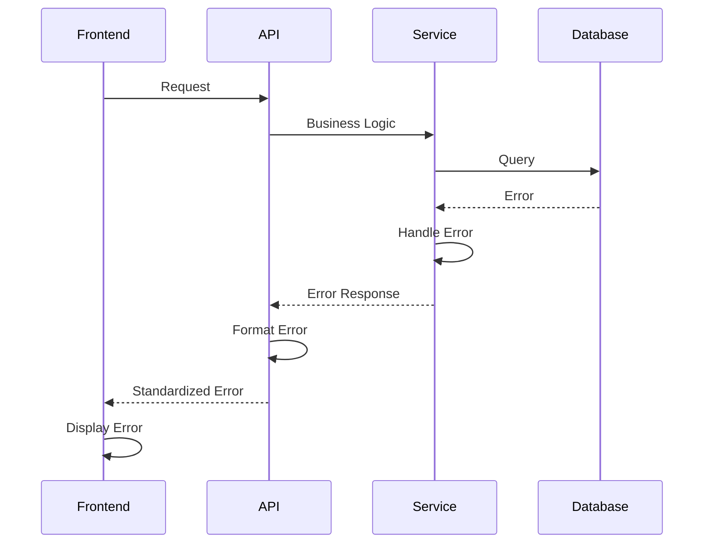

# Coding Standards

## Critical Fullstack Rules

- **Type Sharing:** Always define types in `packages/shared/src/types` and import from there. Never duplicate type definitions.
- **API Calls:** Never make direct HTTP calls in frontend - always use the service layer (`services/api/`).
- **Environment Variables:** Access only through config objects (`config/env.ts`), never `process.env` directly.
- **Error Handling:** All API routes must use the standard error handler middleware. Frontend must handle errors consistently.
- **State Updates:** Never mutate state directly - use proper state management patterns (Zustand actions, React setState).
- **Database Access:** Always use repositories, never direct DbContext access in services.
- **Authentication:** Always check authentication and authorization in middleware/guards, never in business logic.
- **Multi-Tenancy:** Always filter by `tenantId` in database queries. Never expose cross-tenant data.
- **Audit Logging:** All mutations (create, update, delete) must log to audit trail automatically via middleware.

## Naming Conventions

| Element | Frontend | Backend | Example |
|---------|----------|----------|---------|
| Components | PascalCase | - | `UserProfile.tsx` |
| Hooks | camelCase with 'use' | - | `useAuth.ts` |
| Services | camelCase | - | `formService.ts` |
| API Routes | - | kebab-case | `/api/user-profile` |
| Controllers | PascalCase + Controller | PascalCase + Controller | `FormsController.cs` |
| Services | PascalCase + Service | PascalCase + Service | `FormService.cs` |
| Repositories | PascalCase + Repository | PascalCase + Repository | `FormRepository.cs` |
| Database Tables | - | snake_case | `user_profiles` |
| Database Columns | - | snake_case | `created_at` |

## Error Handling Strategy

### Error Flow



### Error Response Format

```typescript
interface ApiError {
  error: {
    code: string;
    message: string;
    details?: Record<string, any>;
    timestamp: string;
    requestId: string;
  };
}
```

### Frontend Error Handling

```typescript
import { ApolloError } from '@apollo/client';

export const handleApiError = (error: ApolloError) => {
  if (error.networkError) {
    // Handle network errors
    return 'Network error. Please check your connection.';
  }
  
  if (error.graphQLErrors.length > 0) {
    const graphQLError = error.graphQLErrors[0];
    return graphQLError.message || 'An error occurred';
  }
  
  return 'An unexpected error occurred';
};
```

### Backend Error Handling

```csharp
namespace FormXChange.Shared.Middleware;

public class ErrorHandlingMiddleware
{
    private readonly RequestDelegate _next;
    private readonly ILogger<ErrorHandlingMiddleware> _logger;
    
    public async Task InvokeAsync(HttpContext context)
    {
        try
        {
            await _next(context);
        }
        catch (Exception ex)
        {
            _logger.LogError(ex, "Unhandled exception");
            await HandleExceptionAsync(context, ex);
        }
    }
    
    private static Task HandleExceptionAsync(HttpContext context, Exception exception)
    {
        var response = new ApiError
        {
            Error = new ErrorDetails
            {
                Code = "INTERNAL_ERROR",
                Message = exception.Message,
                RequestId = context.TraceIdentifier,
                Timestamp = DateTime.UtcNow
            }
        };
        
        context.Response.StatusCode = 500;
        context.Response.ContentType = "application/json";
        return context.Response.WriteAsync(JsonSerializer.Serialize(response));
    }
}
```

