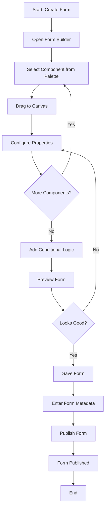
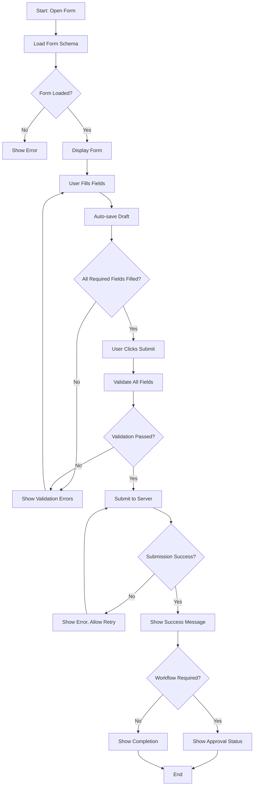
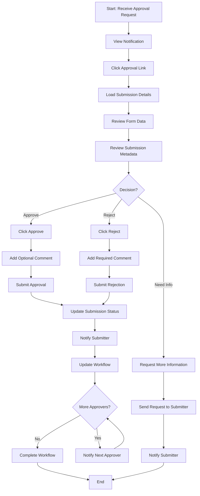
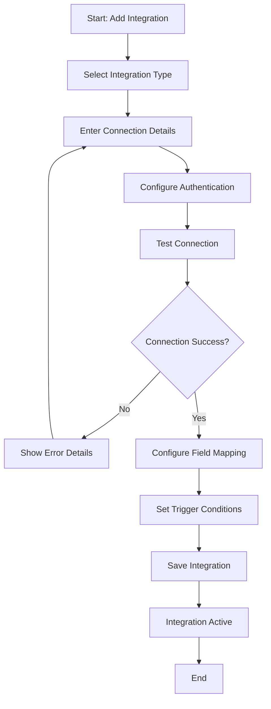

# FormXChange Suite UI/UX Specification

## Introduction

This document defines the user experience goals, information architecture, user flows, and visual design specifications for FormXChange Suite's user interface. It serves as the foundation for visual design and frontend development, ensuring a cohesive and user-centered experience.

### Overall UX Goals & Principles

#### Target User Personas

**Form Builder (Business Analyst):**
- Technical skill level: Low to Medium
- Primary goal: Create complex business forms without coding
- Pain points: Current tools (InfoPath) are deprecated, need modern alternative
- Usage pattern: Regular use, creates multiple forms per week
- Key needs: Intuitive drag-and-drop, visual feedback, template library

**Form User (End User):**
- Technical skill level: Low
- Primary goal: Fill out forms quickly and accurately
- Pain points: Complex forms are confusing, lose progress, unclear validation
- Usage pattern: Occasional to frequent use
- Key needs: Clear instructions, autosave, mobile-friendly, offline support

**Workflow Approver:**
- Technical skill level: Low to Medium
- Primary goal: Review and approve form submissions efficiently
- Pain points: Too many notifications, unclear approval context, mobile access needed
- Usage pattern: Daily use, multiple approvals per day
- Key needs: Quick approval interface, mobile notifications, delegation capability

**System Administrator:**
- Technical skill level: High
- Primary goal: Manage system, users, integrations, and compliance
- Pain points: Complex configuration, need visibility into system health
- Usage pattern: Regular use for configuration, occasional for troubleshooting
- Key needs: Comprehensive admin interface, audit trails, system monitoring

**Compliance Officer:**
- Technical skill level: Medium
- Primary goal: Ensure compliance, track changes, generate reports
- Pain points: Need complete audit trail, difficult to find specific changes
- Usage pattern: Regular use for audits, occasional for reports
- Key needs: Comprehensive audit log viewer, export capabilities, filtering

#### Usability Goals

- **Ease of learning:** New Form Builders can create their first form within 10 minutes without training
- **Efficiency of use:** Power users can create complex forms with conditional logic in under 30 minutes
- **Error prevention:** Clear validation feedback prevents 90% of submission errors before submission
- **Memorability:** Infrequent users can return after 30 days and complete forms without relearning
- **Accessibility:** All users, including those using assistive technologies, can complete all core tasks
- **Mobile experience:** Form filling on mobile devices is as efficient as desktop (within 20% time difference)
- **Offline capability:** Users can fill forms offline and sync automatically when connection restored

#### Design Principles

1. **Clarity over cleverness** - Prioritize clear communication and familiar patterns over aesthetic innovation
2. **Progressive disclosure** - Show only what's needed when it's needed; hide complexity until required
3. **Immediate feedback** - Every user action should have a clear, immediate visual or textual response
4. **Forgiving design** - Allow undo/redo, autosave, and easy error recovery
5. **Accessible by default** - Design for all users from the start, not as an afterthought
6. **Mobile-first thinking** - Design for mobile constraints first, then enhance for desktop
7. **Contextual help** - Provide help exactly when and where users need it

### Change Log

| Date | Version | Description | Author |
|------|---------|-------------|--------|
| 2025-01-12 | 1.0 | Initial UI/UX specification creation | Sally (UX Expert) |

## Information Architecture (IA)

### Site Map / Screen Inventory

```mermaid
graph TD
    A[Homepage / Login] --> B[Dashboard]
    A --> C[Form Builder]
    A --> D[Form Runtime]
    A --> E[Workflow Designer]
    A --> F[Template Library]
    A --> G[Integration Hub]
    A --> H[Admin Console]
    A --> I[Settings]
    
    B --> B1[My Forms]
    B --> B2[Recent Submissions]
    B --> B3[Pending Approvals]
    B --> B4[Analytics]
    
    C --> C1[Create Form]
    C --> C2[Edit Form]
    C --> C3[Form Preview]
    C --> C4[Component Palette]
    C --> C5[Property Panel]
    C --> C6[Rule Builder]
    
    D --> D1[Fill Form]
    D --> D2[View Submission]
    D --> D3[Export PDF]
    
    E --> E1[Design Workflow]
    E --> E2[Workflow Templates]
    E --> E3[Active Workflows]
    E --> E4[Workflow Analytics]
    
    F --> F1[Browse Templates]
    F --> F2[Create Template]
    F --> F3[Template Categories]
    
    G --> G1[SharePoint Config]
    G --> G2[SAP Config]
    G --> G3[D365 Config]
    G --> G4[ServiceNow Config]
    G --> G5[Salesforce Config]
    G --> G6[REST/SOAP Connectors]
    G --> G7[Webhooks]
    
    H --> H1[User Management]
    H --> H2[Role Management]
    H --> H3[Form Management]
    H --> H4[Audit Log Viewer]
    H --> H5[System Health]
    H --> H6[Tenant Management]
    
    I --> I1[Profile Settings]
    I --> I2[Notification Preferences]
    I --> I3[Branding Config]
    I --> I4[Compliance Settings]
```

### Navigation Structure

**Primary Navigation:**
- Horizontal top navigation bar with main sections: Dashboard, Forms, Workflows, Templates, Integrations, Admin (role-based visibility)
- Logo/branding on left, user menu on right
- Active section highlighted
- Breadcrumbs below primary nav for deep navigation

**Secondary Navigation:**
- Contextual sidebar navigation within main sections (e.g., form list sidebar in Forms section)
- Collapsible sidebar for form builder (component palette)
- Right sidebar for property panels and AI assistant

**Breadcrumb Strategy:**
- Show full path for screens deeper than 2 levels
- Clickable breadcrumbs for navigation
- Format: Dashboard > Forms > [Form Name] > Edit
- Hide breadcrumbs on top-level screens (Dashboard, Forms list)

## User Flows

### Flow: Create and Publish Form

**User Goal:** Create a new form from scratch, configure it, and publish it for use.

**Entry Points:**
- Dashboard "Create Form" button
- Forms section "New Form" button
- Template Library "Create from Template" action

**Success Criteria:**
- Form is created and saved
- Form can be previewed
- Form is published and accessible to end users
- Form appears in form list

**Flow Diagram:**

**Edge Cases & Error Handling:**
- Component validation errors: Show inline error messages in property panel
- Save failure: Show error notification, allow retry, auto-save draft
- Network disconnection: Queue save operation, show offline indicator
- Form name conflict: Suggest alternative name, allow override
- Invalid conditional logic: Highlight problematic rules, show error explanation

**Notes:** Form Builder should auto-save every 30 seconds. Users can exit and resume later. Preview mode allows testing form before publishing.

### Flow: Fill Out and Submit Form

**User Goal:** Complete a form submission and submit it for processing.

**Entry Points:**
- Direct form link (public or shared)
- Dashboard "Fill Form" action
- Email notification link
- Mobile app/home screen

**Success Criteria:**
- Form loads correctly
- User can fill all required fields
- Validation errors are clear and actionable
- Submission is successful
- User receives confirmation

**Flow Diagram:**

**Edge Cases & Error Handling:**
- Form not found: Show friendly error with link to form list
- Access denied: Show permission error with contact information
- Validation errors: Show inline errors below each field, summary at top
- Network error during submit: Show retry button, preserve form data
- Duplicate submission: Warn user, allow override or cancel
- Offline submission: Queue submission, sync when online

**Notes:** Autosave happens every 30 seconds. Users can resume drafts. Form supports offline mode via PWA.

### Flow: Approve Form Submission

**User Goal:** Review a form submission and approve or reject it with comments.

**Entry Points:**
- Dashboard "Pending Approvals" notification
- Email notification with approval link
- Teams/Slack notification
- Workflow tasks list

**Success Criteria:**
- Approver can view complete submission
- Approver can see form data clearly
- Approval decision is recorded
- Original submitter is notified
- Workflow progresses correctly

**Flow Diagram:**

**Edge Cases & Error Handling:**
- Submission already processed: Show status, prevent duplicate action
- Approver doesn't have permission: Show error, suggest delegation
- Network error: Allow retry, preserve comment
- Multiple approvers: Show who else needs to approve
- Delegation: Allow approver to delegate to another user

**Notes:** Approvers can view submission history, previous approvals, and workflow progress. Mobile-optimized approval interface for quick decisions.

### Flow: Configure Integration

**User Goal:** Set up integration with external system (e.g., SharePoint, SAP).

**Entry Points:**
- Integration Hub "Add Integration" button
- Form configuration "Add Integration" option
- Admin Console "Integrations" section

**Success Criteria:**
- Integration is configured correctly
- Connection is tested and verified
- Integration appears in active integrations list
- Form can use integration

**Flow Diagram:**

**Edge Cases & Error Handling:**
- Invalid credentials: Show clear error, allow retry
- Connection timeout: Suggest checking network/firewall
- Missing permissions: List required permissions, provide setup guide
- Field mapping errors: Highlight unmapped required fields
- Test failure: Show detailed error log, suggest fixes

**Notes:** Integration configuration includes test mode for validation. Admins can view integration logs and status.

## Wireframes & Mockups

### Design Files

**Primary Design Files:** Design files will be created in Figma. Link will be added once designs are complete.

**Design Tool:** Figma (recommended) or Adobe XD

**Design File Structure:**
- `/Designs/01-Wireframes` - Low-fidelity wireframes
- `/Designs/02-High-Fidelity` - Detailed mockups
- `/Designs/03-Components` - Component library
- `/Designs/04-Responsive` - Mobile/tablet adaptations

### Key Screen Layouts

#### Dashboard

**Purpose:** Central hub showing user's forms, submissions, pending tasks, and quick actions.

**Key Elements:**
- Header with logo, primary navigation, user menu
- Welcome section with user name and quick stats
- "Create Form" prominent CTA button
- Recent forms grid/list view
- Pending approvals card (if applicable)
- Recent submissions list
- Quick links to Templates, Workflows, Integrations
- Activity feed (optional)

**Interaction Notes:**
- Clicking "Create Form" opens Form Builder
- Forms are clickable to open/edit
- Pending approvals show notification badge
- Responsive: Stacks vertically on mobile, grid on desktop

**Design File Reference:** `/Designs/02-High-Fidelity/Dashboard`

#### Form Builder

**Purpose:** Visual form creation interface with drag-and-drop functionality.

**Key Elements:**
- Left sidebar: Component palette with draggable components
- Center: Canvas area showing form preview
- Right sidebar: Property panel for selected component
- Top toolbar: Save, Preview, Publish, Undo/Redo buttons
- Bottom status bar: Auto-save indicator, form metadata

**Interaction Notes:**
- Drag components from palette to canvas
- Click component to select and show properties
- Property changes reflect immediately in canvas
- Preview mode switches to runtime view
- Responsive: Sidebars collapse on smaller screens, canvas remains visible

**Design File Reference:** `/Designs/02-High-Fidelity/FormBuilder`

#### Form Runtime

**Purpose:** End-user interface for filling out forms.

**Key Elements:**
- Form header with name and description
- Form fields rendered from schema
- Inline validation errors
- "Save Draft" and "Submit" buttons
- Progress indicator (for long forms)
- Help text and field descriptions
- Autosave indicator

**Interaction Notes:**
- Fields validate on blur
- Required fields marked with asterisk
- Conditional fields show/hide based on logic
- Submit button disabled until form valid
- Responsive: Single column on mobile, multi-column on desktop

**Design File Reference:** `/Designs/02-High-Fidelity/FormRuntime`

#### Workflow Designer

**Purpose:** Visual workflow creation and configuration interface.

**Key Elements:**
- Canvas with BPMN-like workflow elements
- Toolbar with workflow elements (start, task, gateway, end)
- Property panel for selected element
- Workflow preview/test mode
- Approval chain visualization

**Interaction Notes:**
- Drag workflow elements to canvas
- Connect elements with arrows
- Configure approvers, SLAs, conditions
- Test workflow with sample data
- Responsive: Zoom/pan canvas, touch-friendly on tablets

**Design File Reference:** `/Designs/02-High-Fidelity/WorkflowDesigner`

#### Admin Console

**Purpose:** System administration and management interface.

**Key Elements:**
- Dashboard with system metrics
- Tabbed interface: Users, Roles, Forms, Integrations, Audit Log, System Health
- Data tables with filtering and search
- Bulk actions toolbar
- Configuration panels

**Interaction Notes:**
- Tables support sorting, filtering, pagination
- Bulk selection for multiple items
- Inline editing for simple fields
- Modal dialogs for complex configurations
- Responsive: Tables scroll horizontally on mobile, cards view option

**Design File Reference:** `/Designs/02-High-Fidelity/AdminConsole`

## Component Library / Design System

### Design System Approach

**Design System:** Material-UI (MUI) v5+ or Ant Design

**Rationale:**
- Comprehensive component library reduces development time
- Built-in accessibility features
- Consistent design language
- Active community and documentation
- Customizable theming for white-label branding

**Customization:**
- Custom theme with brand colors
- Extended component variants for form-specific needs
- Custom form components (repeater, matrix, signature)

### Core Components

#### Button

**Purpose:** Primary action trigger for user interactions.

**Variants:**
- Primary (main actions)
- Secondary (secondary actions)
- Text (tertiary actions)
- Icon (icon-only actions)
- Floating Action Button (FAB) for mobile

**States:**
- Default, Hover, Active, Disabled, Loading

**Usage Guidelines:**
- Use primary for main actions (Submit, Save, Create)
- Use secondary for alternative actions (Cancel, Back)
- Disable buttons when action is not available
- Show loading state during async operations
- Minimum touch target: 44x44px on mobile

#### Form Input

**Purpose:** Text input for form fields.

**Variants:**
- Text (single line)
- Textarea (multi-line)
- Number
- Email
- Password
- Search

**States:**
- Default, Focus, Filled, Error, Disabled, Read-only

**Usage Guidelines:**
- Always show label above or as placeholder
- Show validation errors below field
- Provide help text for complex fields
- Use appropriate input type for better mobile keyboards
- Auto-focus first field on form load

#### Dropdown / Select

**Purpose:** Single or multi-select from options list.

**Variants:**
- Single select
- Multi-select
- Searchable
- Grouped options

**States:**
- Default, Open, Selected, Disabled, Error

**Usage Guidelines:**
- Show selected value clearly
- Support keyboard navigation
- Allow search for long lists (>10 items)
- Show "No options" state
- Mobile: Use native select on iOS/Android when appropriate

#### Checkbox / Radio

**Purpose:** Binary or single-choice selection.

**Variants:**
- Checkbox (multiple selection)
- Radio (single selection)
- Switch/Toggle (binary on/off)

**States:**
- Unchecked, Checked, Indeterminate, Disabled

**Usage Guidelines:**
- Use radio for mutually exclusive options
- Use checkbox for independent selections
- Group related options visually
- Show selected state clearly
- Support keyboard selection

#### Date Picker

**Purpose:** Date and time selection.

**Variants:**
- Date only
- Date and time
- Date range
- Month/year picker

**States:**
- Default, Open, Selected, Disabled, Error

**Usage Guidelines:**
- Show calendar popup on focus/click
- Support keyboard input
- Validate date ranges (min/max)
- Format dates according to locale
- Mobile: Use native date picker

#### File Upload

**Purpose:** File selection and upload.

**Variants:**
- Single file
- Multiple files
- Drag-and-drop area
- With preview

**States:**
- Default, Dragging, Uploading, Success, Error

**Usage Guidelines:**
- Show file size and type restrictions
- Display upload progress
- Show file preview for images
- Allow file removal before upload
- Support drag-and-drop on desktop

#### Modal / Dialog

**Purpose:** Overlay for important actions or information.

**Variants:**
- Alert (information)
- Confirm (yes/no)
- Form (complex input)
- Full-screen (mobile)

**States:**
- Closed, Opening, Open, Closing

**Usage Guidelines:**
- Use for critical actions (delete, confirm)
- Prevent background interaction when open
- Provide clear close action (X button, ESC key)
- Focus trap within modal
- Mobile: Full-screen on small devices

#### Table / Data Grid

**Purpose:** Display tabular data with sorting and filtering.

**Variants:**
- Simple table
- Sortable columns
- Filterable columns
- Paginated
- Selectable rows

**States:**
- Loading, Empty, Error, Filled

**Usage Guidelines:**
- Show loading state during data fetch
- Provide empty state message
- Support column sorting
- Enable filtering for searchable columns
- Responsive: Horizontal scroll on mobile or card view

#### Notification / Toast

**Purpose:** Temporary feedback messages for user actions.

**Variants:**
- Success (green)
- Error (red)
- Warning (yellow)
- Info (blue)

**States:**
- Showing, Hiding, Hidden

**Usage Guidelines:**
- Auto-dismiss after 5 seconds (configurable)
- Show in top-right corner (desktop) or top-center (mobile)
- Stack multiple notifications
- Allow manual dismissal
- Don't block user interaction

#### Progress Indicator

**Purpose:** Show progress of operations or form completion.

**Variants:**
- Linear progress bar
- Circular spinner
- Step indicator
- Percentage display

**States:**
- Indeterminate (unknown progress)
- Determinate (known progress)
- Complete

**Usage Guidelines:**
- Use spinner for short operations (<3 seconds)
- Use progress bar for longer operations
- Show percentage when available
- Use step indicator for multi-step processes
- Don't show for operations <1 second

## Branding & Style Guide

### Visual Identity

**Brand Guidelines:** White-label branding supported. Each tenant can customize:
- Logo and favicon
- Color palette
- Typography
- Email templates

**Default Brand Identity:**
- Professional, enterprise-focused
- Clean, modern aesthetic
- Trustworthy and reliable appearance
- Accessible and inclusive

### Color Palette

| Color Type | Hex Code | Usage |
|------------|----------|-------|
| Primary | #1976D2 (Blue) | Main actions, links, primary buttons |
| Secondary | #424242 (Dark Gray) | Secondary actions, text |
| Accent | #FF6F00 (Orange) | Highlights, important notices |
| Success | #2E7D32 (Green) | Success messages, completed states |
| Warning | #F57C00 (Orange) | Warnings, important notices |
| Error | #C62828 (Red) | Errors, destructive actions |
| Neutral | #FAFAFA (Light Gray) | Backgrounds, borders |
| Neutral Dark | #212121 (Dark Gray) | Text on light backgrounds |
| Neutral Light | #FFFFFF (White) | Cards, modals, text on dark |

**Accessibility:**
- All text/background combinations meet WCAG AA contrast ratios (4.5:1)
- Primary color used for interactive elements
- Error color reserved for errors only
- Success color for positive feedback

### Typography

**Font Families:**
- **Primary:** Inter or Roboto (sans-serif, modern, readable)
- **Secondary:** System font stack (fallback)
- **Monospace:** 'Courier New', monospace (for code, technical content)

**Type Scale:**

| Element | Size | Weight | Line Height | Usage |
|---------|------|--------|-------------|-------|
| H1 | 32px | 700 (Bold) | 1.2 | Page titles |
| H2 | 24px | 600 (Semi-bold) | 1.3 | Section headers |
| H3 | 20px | 600 (Semi-bold) | 1.4 | Subsection headers |
| H4 | 18px | 600 (Semi-bold) | 1.4 | Card titles |
| Body | 16px | 400 (Regular) | 1.5 | Body text, form labels |
| Small | 14px | 400 (Regular) | 1.4 | Help text, captions |
| Tiny | 12px | 400 (Regular) | 1.3 | Fine print, timestamps |

**Typography Guidelines:**
- Use H1 once per page
- Maintain clear hierarchy
- Body text minimum 16px for readability
- Line height 1.5 for body text improves readability
- Use bold sparingly for emphasis

### Iconography

**Icon Library:** Material Icons or Heroicons

**Usage Guidelines:**
- Use icons to reinforce meaning, not replace text
- Consistent icon style throughout application
- Icons should be 24px default, 16px for inline, 48px for empty states
- Provide text labels for icon-only buttons (accessibility)
- Use semantic icons (e.g., checkmark for success, X for error)

**Common Icons:**
- Add/Create: `+` or `add`
- Edit: `pencil` or `edit`
- Delete: `trash` or `delete`
- Save: `save` or `check`
- Close: `X` or `close`
- Navigation: `menu`, `arrow-back`, `arrow-forward`
- Status: `check-circle`, `error`, `warning`, `info`

### Spacing & Layout

**Grid System:**
- 12-column grid for desktop layouts
- 8px base unit for spacing
- Maximum content width: 1280px (centered)
- Sidebar width: 280px (collapsible to 64px)

**Spacing Scale:**
- 4px: Tight spacing (icon to text)
- 8px: Base unit (small gaps)
- 16px: Standard spacing (between form fields)
- 24px: Medium spacing (between sections)
- 32px: Large spacing (between major sections)
- 48px: Extra large spacing (page margins)

**Layout Principles:**
- Consistent padding: 16px on mobile, 24px on desktop
- White space creates visual hierarchy
- Group related elements with less spacing
- Separate unrelated elements with more spacing

## Accessibility Requirements

### Compliance Target

**Standard:** WCAG 2.1 Level AA

### Key Requirements

**Visual:**
- Color contrast ratios: Minimum 4.5:1 for normal text, 3:1 for large text (18pt+)
- Focus indicators: Visible 2px outline with 2px offset, high contrast color
- Text sizing: Support browser zoom up to 200% without horizontal scrolling
- Color independence: Don't rely solely on color to convey information

**Interaction:**
- Keyboard navigation: All interactive elements accessible via keyboard (Tab, Enter, Space, Arrow keys)
- Screen reader support: Proper ARIA labels, roles, and live regions
- Touch targets: Minimum 44x44px on mobile devices
- Focus management: Logical tab order, focus trap in modals

**Content:**
- Alternative text: All images and icons have descriptive alt text
- Heading structure: Proper H1-H6 hierarchy, no skipped levels
- Form labels: All form fields have associated labels (visible or aria-label)
- Error messages: Clear, descriptive error messages associated with fields
- Language: Set lang attribute on HTML element

### Testing Strategy

- **Automated Testing:** axe DevTools, Lighthouse accessibility audit
- **Manual Testing:** Keyboard-only navigation, screen reader testing (NVDA, JAWS, VoiceOver)
- **User Testing:** Test with users who rely on assistive technologies
- **Continuous:** Include accessibility checks in CI/CD pipeline

## Responsiveness Strategy

### Breakpoints

| Breakpoint | Min Width | Max Width | Target Devices |
|------------|-----------|-----------|----------------|
| Mobile | 320px | 767px | Smartphones (iPhone, Android) |
| Tablet | 768px | 1279px | Tablets (iPad, Android tablets) |
| Desktop | 1280px | 1919px | Laptops, desktop monitors |
| Wide | 1920px | - | Large desktop monitors |

### Adaptation Patterns

**Layout Changes:**
- Mobile: Single column layout, stacked elements
- Tablet: Two-column layout where appropriate
- Desktop: Multi-column layouts, sidebars visible
- Navigation: Hamburger menu on mobile, horizontal nav on desktop
- Tables: Horizontal scroll on mobile, or card view alternative

**Navigation Changes:**
- Mobile: Bottom navigation bar or hamburger menu
- Tablet: Collapsible sidebar navigation
- Desktop: Horizontal top navigation with persistent sidebar
- Breadcrumbs: Full breadcrumbs on desktop, simplified on mobile

**Content Priority:**
- Mobile: Show most important content first, hide secondary features
- Desktop: Show all features, use available space efficiently
- Progressive enhancement: Core features work on all devices, enhanced features on larger screens

**Interaction Changes:**
- Mobile: Touch-optimized buttons (larger), swipe gestures
- Desktop: Hover states, keyboard shortcuts
- Form Builder: Simplified interface on mobile, full feature set on desktop
- Workflow Designer: Touch-friendly on tablet, precise on desktop

## Animation & Micro-interactions

### Motion Principles

- **Purposeful:** Animations should serve a purpose (feedback, orientation, delight)
- **Fast:** Animations should be quick (200-300ms for transitions, 100-200ms for micro-interactions)
- **Natural:** Use easing functions that feel natural (ease-in-out)
- **Respectful:** Respect user preferences (prefers-reduced-motion)
- **Performance:** 60fps animations, use CSS transforms/opacity

### Key Animations

- **Page Transitions:** Fade in (200ms, ease-in-out) - Smooth page transitions
- **Modal Open/Close:** Scale + fade (250ms, ease-out) - Modal appearance
- **Button Press:** Scale down (100ms, ease-in) - Button feedback
- **Form Validation:** Shake error (300ms, ease-in-out) - Error indication
- **Loading Spinner:** Rotate (1s, linear, infinite) - Loading state
- **Success Checkmark:** Scale + fade (400ms, ease-out) - Success feedback
- **Dropdown Open:** Slide down + fade (200ms, ease-out) - Dropdown appearance
- **Toast Notification:** Slide in from top (300ms, ease-out) - Notification appearance

**Animation Guidelines:**
- Use CSS animations/transitions when possible (better performance)
- Use JavaScript animations for complex interactions
- Respect `prefers-reduced-motion` media query
- Test animations on lower-end devices
- Keep animations subtle and professional

## Performance Considerations

### Performance Goals

- **Page Load:** Initial page load < 3 seconds on 3G connection
- **Interaction Response:** UI responds to user input within 100ms
- **Animation FPS:** Maintain 60fps for all animations
- **Form Rendering:** Form renders in < 2 seconds (as per NFR7)

### Design Strategies

- **Lazy Loading:** Load images and components as they come into view
- **Progressive Enhancement:** Core functionality works without JavaScript
- **Optimized Assets:** Compress images, use modern formats (WebP)
- **Code Splitting:** Load only necessary JavaScript for current route
- **Skeleton Screens:** Show loading placeholders instead of spinners
- **Optimistic UI:** Update UI immediately, sync with server in background

## Next Steps

### Immediate Actions

1. Review UI/UX specification with stakeholders for approval
2. Create high-fidelity mockups in Figma based on wireframes
3. Develop component library in design tool
4. Create responsive designs for mobile and tablet
5. Prepare design handoff documentation for developers
6. Conduct usability testing with target user personas
7. Iterate on designs based on feedback

### Design Handoff Checklist

- [x] All user flows documented
- [x] Component inventory complete
- [x] Accessibility requirements defined
- [x] Responsive strategy clear
- [x] Brand guidelines incorporated
- [x] Performance goals established
- [ ] High-fidelity mockups created
- [ ] Design system documented
- [ ] Responsive designs completed
- [ ] Developer handoff package prepared

## Checklist Results

_This section will be populated after running a UI/UX checklist if available._

