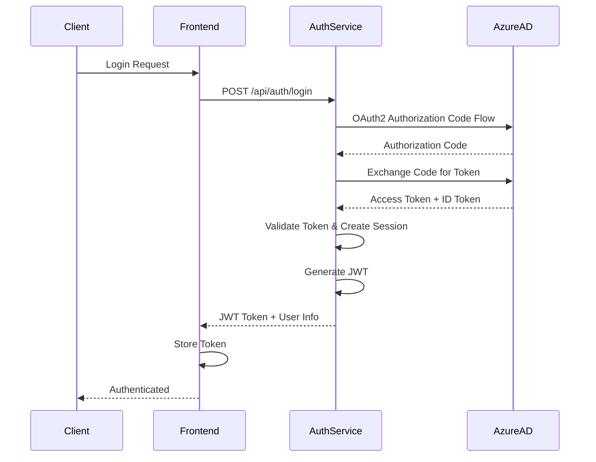

# Story 1.2: Authentication and Authorization Service

## Status

InProgress

## Story

**As a** system administrator,
**I want** OAuth2/OIDC authentication with Azure AD integration,
**so that** enterprise users can securely access the application.

## Acceptance Criteria

1. OAuth2/OIDC authentication service implemented (.NET 8)
2. Integration with Azure AD / Entra ID for enterprise SSO
3. JWT token generation and validation
4. Refresh token mechanism implemented
5. Role-based access control (RBAC) foundation with roles: Admin, Form Builder, Form User, Viewer
6. API endpoints protected with authorization middleware
7. Frontend authentication flow with secure token storage
8. Logout functionality with token invalidation
9. User profile endpoint returning authenticated user information
10. Error handling for authentication failures with appropriate HTTP status codes

## Tasks / Subtasks

- [ ] Task 1: Create Auth Service Project Structure (AC: 1)
  - [ ] Create apps/auth-service/ directory structure
  - [ ] Initialize .NET 8 ASP.NET Core Web API project
  - [ ] Set up project file (AuthService.csproj) with required dependencies
  - [ ] Configure Program.cs with minimal API setup
  - [ ] Create Controllers/, Services/, Models/, Middleware/ directories
  - [ ] Set up dependency injection container

- [ ] Task 2: Implement OAuth2/OIDC Authentication (AC: 1, 2)
  - [ ] Install Microsoft.AspNetCore.Authentication.JwtBearer package
  - [ ] Install Microsoft.Identity.Web package for Azure AD integration
  - [ ] Configure Azure AD authentication in Program.cs
  - [ ] Set up OAuth2/OIDC authentication scheme
  - [ ] Configure Azure AD app registration settings (ClientId, TenantId, Instance)
  - [ ] Implement authentication middleware
  - [ ] Create login endpoint (POST /api/auth/login) that redirects to Azure AD
  - [ ] Handle OAuth2 callback and extract user claims
  - [ ] Store user information in database after first login

- [ ] Task 3: Implement JWT Token Generation and Validation (AC: 3)
  - [ ] Configure JWT token settings (issuer, audience, secret key, expiration)
  - [ ] Create JwtTokenService for token generation
  - [ ] Generate JWT access tokens with user claims (id, email, roles)
  - [ ] Implement JWT token validation middleware
  - [ ] Configure token validation parameters (issuer, audience, signing key)
  - [ ] Add token validation to authentication pipeline
  - [ ] Handle token expiration errors appropriately

- [ ] Task 4: Implement Refresh Token Mechanism (AC: 4)
  - [ ] Create RefreshToken model in database
  - [ ] Implement refresh token generation (long-lived, secure random token)
  - [ ] Store refresh tokens in database with expiration and user association
  - [ ] Create refresh token endpoint (POST /api/auth/refresh)
  - [ ] Validate refresh token and generate new access token
  - [ ] Implement refresh token rotation (invalidate old, create new)
  - [ ] Handle refresh token expiration and revocation

- [ ] Task 5: Implement RBAC Foundation (AC: 5)
  - [ ] Create Role enum/constants: Admin, FormBuilder, FormUser, Viewer
  - [ ] Create User model with roles array/collection
  - [ ] Create database schema for users table (id, email, display_name, roles, tenant_id, is_active, created_at, updated_at)
  - [ ] Create UserRepository for user data access
  - [ ] Create UserService for user management
  - [ ] Implement role assignment during user creation/login
  - [ ] Create authorization policies for each role
  - [ ] Configure authorization middleware with role-based policies

- [ ] Task 6: Protect API Endpoints with Authorization (AC: 6)
  - [ ] Create AuthorizationMiddleware for request authorization
  - [ ] Implement [Authorize] attribute usage on controllers/endpoints
  - [ ] Create role-based authorization attributes ([Authorize(Roles = "Admin")])
  - [ ] Protect all API endpoints except public/auth endpoints
  - [ ] Implement authorization checks in middleware
  - [ ] Return 401 Unauthorized for missing/invalid tokens
  - [ ] Return 403 Forbidden for insufficient permissions

- [ ] Task 7: Implement Frontend Authentication Flow (AC: 7)
  - [ ] Create frontend auth service (apps/web/src/services/api/auth.ts)
  - [ ] Implement login function that redirects to Azure AD
  - [ ] Handle OAuth2 callback and extract tokens
  - [ ] Store access token securely (httpOnly cookie or memory, not localStorage)
  - [ ] Store refresh token in httpOnly cookie
  - [ ] Create useAuth hook for React components
  - [ ] Create auth store (Zustand) for global auth state
  - [ ] Implement token refresh logic in frontend
  - [ ] Create ProtectedRoute component for route protection

- [ ] Task 8: Implement Logout Functionality (AC: 8)
  - [ ] Create logout endpoint (POST /api/auth/logout)
  - [ ] Invalidate refresh token in database
  - [ ] Clear user session in Redis (if using session storage)
  - [ ] Return success response
  - [ ] Implement frontend logout function
  - [ ] Clear tokens from storage/cookies
  - [ ] Redirect to login page
  - [ ] Clear auth state in frontend store

- [ ] Task 9: Implement User Profile Endpoint (AC: 9)
  - [ ] Create GET /api/auth/me endpoint
  - [ ] Extract user ID from JWT token claims
  - [ ] Query user from database by ID
  - [ ] Return user information (id, email, displayName, roles, attributes)
  - [ ] Include tenant information if applicable
  - [ ] Handle user not found errors
  - [ ] Create frontend hook to fetch current user (useCurrentUser)

- [ ] Task 10: Implement Error Handling (AC: 10)
  - [ ] Create custom authentication exceptions
  - [ ] Implement error handling middleware for auth errors
  - [ ] Return 401 for authentication failures (invalid token, expired token)
  - [ ] Return 403 for authorization failures (insufficient permissions)
  - [ ] Return 400 for invalid request (missing credentials, malformed token)
  - [ ] Return 500 for server errors with generic message
  - [ ] Log authentication errors with correlation IDs
  - [ ] Create standardized error response format

- [ ] Task 11: Write Tests (All ACs)
  - [ ] Create unit tests for JwtTokenService
  - [ ] Create unit tests for UserService
  - [ ] Create unit tests for RefreshTokenService
  - [ ] Create integration tests for login endpoint
  - [ ] Create integration tests for refresh token endpoint
  - [ ] Create integration tests for logout endpoint
  - [ ] Create integration tests for user profile endpoint
  - [ ] Create integration tests for authorization middleware
  - [ ] Create tests for error handling scenarios
  - [ ] Achieve >80% code coverage

## Dev Notes

### Previous Story Insights

From Story 1.1:
- Monorepo structure is established with Nx workspace
- Environment configuration template (.env.example) includes Azure AD settings
- PostgreSQL and Redis are configured for local development
- CI/CD pipeline is set up for automated testing

### Data Models

**User Model:**
```typescript
interface User {
  id: string;                    // UUID
  email: string;                 // Unique, from Azure AD
  displayName: string;           // From Azure AD
  roles: Role[];                 // Array of roles: Admin, FormBuilder, FormUser, Viewer
  attributes: UserAttributes;   // ABAC attributes (department, costCenter, location)
  tenantId: string;              // UUID - Multi-tenant isolation
  isActive: boolean;             // User active status
  lastLoginAt?: Date;            // Last login timestamp
  createdAt: Date;
  updatedAt: Date;
}
```

**RefreshToken Model:**
```typescript
interface RefreshToken {
  id: string;                    // UUID
  token: string;                 // Secure random token
  userId: string;                // Foreign key to User
  expiresAt: Date;               // Expiration timestamp
  createdAt: Date;
  revokedAt?: Date;              // Revocation timestamp
}
```

**Role Enum:**
```typescript
enum Role {
  Admin = "Admin",
  FormBuilder = "FormBuilder",
  FormUser = "FormUser",
  Viewer = "Viewer"
}
```

[Source: docs/architecture.md#data-models]

### API Specifications

**Authentication Endpoints:**

- `POST /api/auth/login` - Initiate OAuth2/OIDC login (redirects to Azure AD)
  - Response: Redirect to Azure AD authorization endpoint
  - Query params: `returnUrl` (optional)

- `GET /api/auth/callback` - OAuth2 callback handler
  - Query params: `code`, `state`
  - Response: Redirects to frontend with tokens or error

- `POST /api/auth/refresh` - Refresh access token
  - Request Body: `{ "refreshToken": "string" }`
  - Response: `{ "accessToken": "string", "refreshToken": "string", "expiresIn": number }`
  - Status Codes: 200 OK, 401 Unauthorized (invalid/expired refresh token)

- `POST /api/auth/logout` - Logout user
  - Headers: `Authorization: Bearer {accessToken}`
  - Response: `{ "success": true }`
  - Status Codes: 200 OK, 401 Unauthorized

- `GET /api/auth/me` - Get current user profile
  - Headers: `Authorization: Bearer {accessToken}`
  - Response: `{ "id": "uuid", "email": "string", "displayName": "string", "roles": ["Admin"], "attributes": {...} }`
  - Status Codes: 200 OK, 401 Unauthorized

- `GET /api/auth/permissions` - Get user permissions
  - Headers: `Authorization: Bearer {accessToken}`
  - Response: `{ "permissions": ["form:create", "form:read", ...] }`
  - Status Codes: 200 OK, 401 Unauthorized

[Source: docs/architecture.md#components - Auth Service]

**Authentication Flow:**


[Source: docs/architecture.md#authentication-and-authorization]

### Component Specifications

No UI components required for this story - backend service only. Frontend authentication flow will be implemented in Task 7.

### File Locations

**Backend Service Structure:**
```
apps/auth-service/
├── src/
│   ├── Controllers/
│   │   └── AuthController.cs          # Auth endpoints
│   ├── Services/
│   │   ├── AuthService.cs             # Authentication logic
│   │   ├── JwtTokenService.cs         # JWT token generation/validation
│   │   ├── RefreshTokenService.cs     # Refresh token management
│   │   └── UserService.cs             # User management
│   ├── Repositories/
│   │   ├── IUserRepository.cs
│   │   ├── UserRepository.cs
│   │   ├── IRefreshTokenRepository.cs
│   │   └── RefreshTokenRepository.cs
│   ├── Models/
│   │   ├── User.cs                    # User entity
│   │   ├── RefreshToken.cs            # RefreshToken entity
│   │   ├── Role.cs                    # Role enum
│   │   └── DTOs/                      # Data transfer objects
│   │       ├── LoginRequest.cs
│   │       ├── LoginResponse.cs
│   │       ├── RefreshTokenRequest.cs
│   │       └── UserProfileResponse.cs
│   ├── Middleware/
│   │   ├── AuthenticationMiddleware.cs
│   │   └── AuthorizationMiddleware.cs
│   ├── Configuration/
│   │   └── AuthConfiguration.cs       # Auth settings
│   └── Program.cs                     # Application entry point
├── tests/
│   ├── Unit/
│   │   ├── Services/
│   │   └── Repositories/
│   └── Integration/
│       └── Controllers/
└── AuthService.csproj
```

**Frontend Files (Task 7):**
```
apps/web/src/
├── services/
│   └── api/
│       └── auth.ts                    # Auth API client
├── stores/
│   └── authStore.ts                   # Zustand auth store
└── hooks/
    └── useAuth.ts                     # Auth hook
```

[Source: docs/architecture/source-tree.md]

### Testing Requirements

**Test File Location:**
- Backend unit tests: `apps/auth-service/tests/Unit/`
- Backend integration tests: `apps/auth-service/tests/Integration/`
- Frontend tests: `apps/web/tests/` (for auth-related components)

**Testing Frameworks:**
- Backend: xUnit + Moq [Source: docs/architecture/tech-stack.md]
- Frontend: Vitest + React Testing Library [Source: docs/architecture/tech-stack.md]

**Testing Patterns:**
- Unit tests for services (JwtTokenService, UserService, RefreshTokenService)
- Integration tests for API endpoints
- Mock Azure AD responses for testing
- Test token generation and validation
- Test refresh token flow
- Test authorization middleware
- Test error scenarios (invalid token, expired token, insufficient permissions)

**Test Coverage Target:** >80% for business logic [Source: docs/architecture.md#testing-strategy]

### Technical Constraints

**Technology Stack:**
- Backend Framework: ASP.NET Core 8.0 [Source: docs/architecture/tech-stack.md]
- Authentication Library: Microsoft.Identity.Web (Azure AD integration) [Source: docs/architecture.md#components - Auth Service]
- JWT Library: Microsoft.AspNetCore.Authentication.JwtBearer [Source: docs/architecture.md#components - Auth Service]
- Database: PostgreSQL 15+ with Entity Framework Core [Source: docs/architecture/tech-stack.md]
- Cache: Redis 7.2+ for session storage (optional) [Source: docs/architecture/tech-stack.md]

**Azure AD Configuration:**
- Requires Azure AD app registration
- ClientId, ClientSecret, TenantId from environment variables
- Instance: https://login.microsoftonline.com/
- Scopes: openid, profile, email

**JWT Token Configuration:**
- Issuer: Application name/URL
- Audience: Application name/URL
- Secret Key: From environment variable (JWT_SECRET)
- Access Token Expiration: 15 minutes (configurable)
- Refresh Token Expiration: 7 days (configurable)
- Algorithm: HS256 or RS256

**Security Requirements:**
- Access tokens stored in memory (frontend) or httpOnly cookies
- Refresh tokens stored in httpOnly cookies only
- Never store tokens in localStorage (XSS vulnerability)
- Implement CSRF protection for cookie-based auth
- Use HTTPS in production
- Validate token signature and expiration
- Implement token rotation for refresh tokens

**Database Schema:**
```sql
-- Users table (from architecture)
CREATE TABLE users (
    id UUID PRIMARY KEY DEFAULT gen_random_uuid(),
    email VARCHAR(255) NOT NULL UNIQUE,
    display_name VARCHAR(255) NOT NULL,
    roles TEXT[] DEFAULT '{}',
    attributes JSONB DEFAULT '{}',
    tenant_id UUID NOT NULL REFERENCES tenants(id) ON DELETE CASCADE,
    is_active BOOLEAN DEFAULT TRUE,
    last_login_at TIMESTAMP WITH TIME ZONE,
    created_at TIMESTAMP WITH TIME ZONE DEFAULT NOW(),
    updated_at TIMESTAMP WITH TIME ZONE DEFAULT NOW()
);

-- Refresh tokens table
CREATE TABLE refresh_tokens (
    id UUID PRIMARY KEY DEFAULT gen_random_uuid(),
    token VARCHAR(255) NOT NULL UNIQUE,
    user_id UUID NOT NULL REFERENCES users(id) ON DELETE CASCADE,
    expires_at TIMESTAMP WITH TIME ZONE NOT NULL,
    created_at TIMESTAMP WITH TIME ZONE DEFAULT NOW(),
    revoked_at TIMESTAMP WITH TIME ZONE
);

CREATE INDEX idx_refresh_tokens_token ON refresh_tokens(token);
CREATE INDEX idx_refresh_tokens_user_id ON refresh_tokens(user_id);
CREATE INDEX idx_refresh_tokens_expires_at ON refresh_tokens(expires_at);
```

[Source: docs/architecture.md#database-schema]

**Environment Variables Required:**
- `AzureAD__ClientId` - Azure AD application client ID
- `AzureAD__ClientSecret` - Azure AD application client secret
- `AzureAD__TenantId` - Azure AD tenant ID
- `AzureAD__Instance` - Azure AD instance URL (default: https://login.microsoftonline.com/)
- `JWT_SECRET` - Secret key for JWT token signing
- `ConnectionStrings__DefaultConnection` - PostgreSQL connection string
- `Redis__ConnectionString` - Redis connection string (optional, for session storage)

[Source: docs/architecture.md#development-workflow]

### Project Structure Notes

The auth service follows the backend architecture pattern defined in the architecture document. All files should be created in `apps/auth-service/` according to the structure specified above.

[Source: docs/architecture/source-tree.md]

## Testing

### Testing Standards

**Test File Location:**
- Backend unit tests: `apps/auth-service/tests/Unit/Services/`, `apps/auth-service/tests/Unit/Repositories/`
- Backend integration tests: `apps/auth-service/tests/Integration/Controllers/`
- Frontend tests: `apps/web/tests/` (for auth hooks and components)

**Testing Frameworks:**
- Backend: xUnit + Moq [Source: docs/architecture/tech-stack.md]
- Frontend: Vitest + React Testing Library [Source: docs/architecture/tech-stack.md]

**Testing Patterns:**
- Unit tests for all services (mock dependencies)
- Integration tests for API endpoints (test full request/response cycle)
- Mock Azure AD responses for testing authentication flow
- Test JWT token generation and validation
- Test refresh token generation, validation, and rotation
- Test authorization middleware with different roles
- Test error scenarios (invalid credentials, expired tokens, insufficient permissions)
- Test multi-tenancy isolation (users can only access their tenant data)

**Test Coverage Target:** >80% for business logic [Source: docs/architecture.md#testing-strategy]

**Specific Test Cases:**
- Login with valid Azure AD credentials → returns JWT token
- Login with invalid credentials → returns 401
- Refresh token with valid token → returns new access token
- Refresh token with expired token → returns 401
- Refresh token rotation → old token invalidated, new token created
- Logout → refresh token revoked
- Get user profile with valid token → returns user data
- Get user profile with invalid token → returns 401
- Access protected endpoint with Admin role → returns 200
- Access protected endpoint with Viewer role → returns 403 if insufficient permissions
- Token expiration → returns 401 with refresh token hint

## Change Log

| Date | Version | Description | Author |
|------|---------|-------------|--------|
| 2025-01-12 | 1.0 | Initial story creation | Bob (Scrum Master) |

## Dev Agent Record

_This section will be populated by the development agent during implementation_

### Agent Model Used

_To be filled by Dev Agent_

### Debug Log References

_To be filled by Dev Agent_

### Completion Notes List

_To be filled by Dev Agent_

### File List

_To be filled by Dev Agent - will list all files created/modified during implementation_

## QA Results

_This section will be populated by the QA Agent after review_

